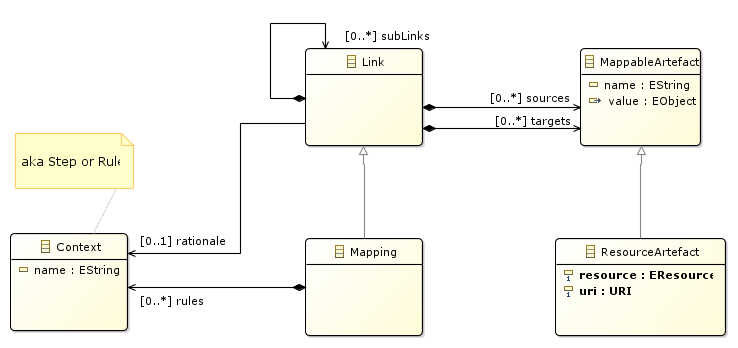

//Start of user code title
Mapping
=======
//End of user code
:data-uti:
:doctype: book
//Start of user code header
//End of user code

//Start of user code preface

== Introduction

The goal of the meta-model-to-be is to keep traces of transformations done on a model before applying some analysis or simulations and then be able to interpret back on original model the result.

The simpler solution would be a kind of map, ie a tuple between an object of the original model (eg design) to the target model (eg analysis).
While this shall work on some simple transformations, this is a well known problem in model-to-model (M2M) transformation community.

For instance, we shall have a look at
 
* trace mechanism of Kermeta (Falleri et al., 2006),
* trace mechanism of QVT,
* trace mechanism of ATL.

The global idea of those metamodels is to add a context to links. The context may, for instance, contain a link to rule that has produced it. One advantage is to provides error localization if target model is wrong. It also enables to adapt the back-interpretation of analysis result.

== Requirements

* Trace from EResource to EResource so as to know source and target models.
* Provide a named context for each links so as to understand the origin of a target element, but also for analysis re-interpretation on original design.
* Have hierarchical links so as to make traces understandable on high level view. For instance, when splitting a Task we understand that it also means duplicating some WorkloadEvent for instance, and we do not want both to be at same level.

The root object of a mapping file will be ...a Mapping object with one source and one target each of Resource Artifact kind. It will also contain rules declarations used by the transformation. And finally comes the (sub)links from object to object, all via MappableArtefact.

//End of user code

[[mapping_package]]
== Mapping package

=== Overview

.mapping-class-diagram-overview
[caption="mapping class diagram overview -- http://www.polarsys.org/time4sys/trace/1.0"]

//Start of user code mappingoverview
//End of user code

[[link_classifier]]
=== Link classifier

//Start of user code Link-overview
A Link enable one to track transformation result from source to target models.
A Link is kept because of a context, eg a step in multi-step rule, or a rule transformation.
//End of user code

==== Specializations

* <<mapping_classifier,Mapping>> from <<mapping_package,mapping>>

==== Semantics

//Start of user code Link-semantics
TODO: write a semantic
//End of user code

[[mappableartefact_classifier]]
=== MappableArtefact classifier

//Start of user code MappableArtefact-overview
A Mappable Artefact enables to identify objects that are part of a transformation.
//End of user code

==== Specializations

* <<resourceartefact_classifier,ResourceArtefact>> from <<mapping_package,mapping>>

==== Attributes

* name: EString [0:1]

==== Semantics

//Start of user code MappableArtefact-semantics
TODO: write a semantic
//End of user code

[[mapping_classifier]]
=== Mapping classifier

//Start of user code Mapping-overview
This is the root object of a mapping file. It has at least one source and obe target each of kind ResourceArtefact.
It will also contain rules declarations used by the transformation (ie instance of Context).
//End of user code

==== Generalizations

* <<link_classifier,Link>> from <<mapping_package,mapping>>

==== Semantics

//Start of user code Mapping-semantics
TODO: write a semantic
//End of user code

[[context_classifier]]
=== Context classifier

//Start of user code Context-overview
The context enables to declares rules or steps of a transformation. 
//End of user code

==== Attributes

* name: EString [0:1]

==== Semantics

//Start of user code Context-semantics
TODO: write a semantic
//End of user code

[[resourceartefact_classifier]]
=== ResourceArtefact classifier

//Start of user code ResourceArtefact-overview
TODO: write an overview
//End of user code

==== Generalizations

* <<mappableartefact_classifier,MappableArtefact>> from <<mapping_package,mapping>>

==== Attributes

* resource: EResource [1:1]
* uri: URI [1:1]

==== Semantics

//Start of user code ResourceArtefact-semantics
TODO: write a semantic
//End of user code

[[uri_classifier]]
=== URI classifier

//Start of user code URI-overview
TODO: write an overview
//End of user code

See org.eclipse.emf.common.util.URI.

//Start of user code URI-semantics
TODO: write a semantic
//End of user code

//Start of user code postface

:numbered!:

[bibliography]
Bibliography
-----------

[bibliography]
- [[[trace]]] 'TRACEABILITY MECHANISM FOR ERROR LOCALIZATION IN MODEL TRANSFORMATION', Vincent Aranega, Jean-Marie Mottu, Anne Etien, Jean-Luc Dekeyser, https://pdfs.semanticscholar.org/2785/ef15d8cbce31e4a19db17a3c6fc8d07fde4a.pdf
- [[[traceengine]]] 'A Traceability Engine Dedicated to Model Transformation for Software Engineering', Bastien Amar, Hervé Leblanc, and Bernard Coulette, http://citeseerx.ist.psu.edu/viewdoc/download?doi=10.1.1.211.8794&rep=rep1&type=pdf
- [[[distribm2m]]] 'Distributed Model-to-Model Transformation with ATL on MapReduce', Amine Benelallam, Abel Gómez, Massimo Tisi, Jordi Cabot https://hal.archives-ouvertes.fr/hal-01215228/document
- [[[locatrans]]] 'Localized Model Transformations for Building Large-Scale Transformations', Anne Etien, Alexis Muller, Thomas Legrand, and Richard F. Paige, http://www.lifl.fr/~etien/Publies/localized.pdf

//End of user code

