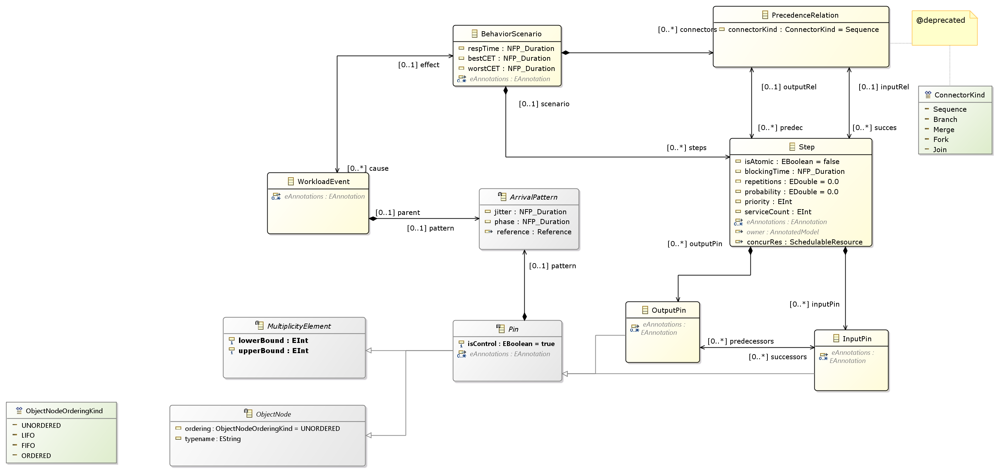

//Start of user code title
Marte by Time4Sys
=================
//End of user code
:data-uti:
:doctype: book
//Start of user code header
:toc:
:toclevels: 2
//End of user code

//Start of user code preface

== Introduction

This document presents the main result of the Waruna project, ie an Ecore implementation of the OMG's Marte specification.
This implementation follow quite closely its original specification excepts in a few areas as explained in following chapter.

== Deviation from OMG Marte specication

=== Pattern of Activation

.activation-pattern
[caption="Pattern of activations"]
image::activation-pattern.png[]

Contraryly to the Marte specification, we have flatten the hierarchy and also haven't (yet?) implemented all pattern.

.Comparions of arrival pattern table
[options="header",cols="3,^1,^1,10"]
|==============================================
|Pattern          |Marte |Time4Sys |Description
|PeriodicPattern  |X |X |
It describes periodic interarrival patterns, with an optional maximal deviation (jitter)

|AperiodicPattern |X | |
It describes an unbounded pattern that is defined by a distribution function.

|SporadicPattern  |X |X |
It describes a bounded pattern that is defined by a corner case interarrival times and a maximum deviation (jitter).

|BurstPattern     |X |X |
It describes a bursty interarrival pattern with a number of events that can occur in a bounded period.

|IrregularPattern |X | |
It describes an aperiodic pattern that is described by a table of successive interarrivals durations measured from a starting phase.

|ClosedPattern    |X | |
It describes a workload characterized by a fixed number of active or potential users or jobs that cycle between executing the scenario.

|OpenPattern      |X | |
It describes a workload that is modeled as a stream of requests that arrive at a given rate in some predetermined pattern (such as Poisson arrivals).

|SlidingWindowPattern | |X |
It describes a bounded pattern that is defined by the maximum number  of events that can occur on a sliding window.

|==============================================

=== Links of Precedence between tasks

.precedence-diagram
[caption="Precedence Class diagram"]

The model from Marte is not precise enough to express other than simple relationship.
Thus we reuse the concepts of Pin from the UML 2.5 Activity Diagram.

NB: Shall we also reuse ActivityEdge instead of the successor-predecessor link?

=== EndToEnd Flow

.endtoendflow-diagram
[caption="End-to-End Flow Class diagram"]
image::endtoendflow-diagram.png[]

This class is modeled in the Gqam Package while originally it is from the Sam MARTE subpackage.
This is subject to futur modification, especially when the constraint (aka timing requirements) will be further developped.

//End of user code

[[marte_package]]
== Marte package

=== Overview

.Marte-class-diagram-overview
[caption="Marte class diagram overview -- http://www.polarsys.org/time4sys/marte/1.0"]
image::Marte-class-diagram-overview.png[]

//Start of user code Marteoverview
//End of user code

[[coreelements_package]]
== Coreelements package

=== Overview

.coreelements-class-diagram-overview
[caption="coreelements class diagram overview -- http://www.polarsys.org/time4sys/marte/core/1.0"]
image::coreelements-class-diagram-overview.png[]

//Start of user code coreelementsoverview
//End of user code

[[abstractioncoreelements_classifier]]
=== Abstraction classifier

//Start of user code Abstraction-overview
TODO: write an overview
//End of user code

==== Generalizations

* <<dependencycoreelements_classifier,Dependency>> from <<coreelements_package,coreelements>>

==== Specializations

* <<allocatealloc_classifier,Allocate>> from <<alloc_package,alloc>>

==== Semantics

//Start of user code Abstraction-semantics
TODO: write a semantic
//End of user code

[[constraintcoreelements_classifier]]
=== Constraint classifier

//Start of user code Constraint-overview
TODO: write an overview
//End of user code

==== Generalizations

* <<packageableelementcoreelements_classifier,PackageableElement>> from <<coreelements_package,coreelements>>

==== Specializations

* <<constraintannotation_classifier,Constraint>> from <<annotation_package,annotation>>
* <<latencyobservergqam_classifier,LatencyObserver>> from <<gqam_package,gqam>>
* <<timedobservergqam_classifier,TimedObserver>> from <<gqam_package,gqam>>
* <<schedulingobserversam_classifier,SchedulingObserver>> from <<sam_package,sam>>

==== Semantics

//Start of user code Constraint-semantics
TODO: write a semantic
//End of user code

[[dependencycoreelements_classifier]]
=== Dependency classifier

from UML 2.5

//Start of user code Dependency-overview
TODO: write an overview
//End of user code

==== Generalizations

* <<directedrelationshipcoreelements_classifier,DirectedRelationship>> from <<coreelements_package,coreelements>>
* <<packageableelementcoreelements_classifier,PackageableElement>> from <<coreelements_package,coreelements>>

==== Specializations

* <<abstractioncoreelements_classifier,Abstraction>> from <<coreelements_package,coreelements>>
* <<allocatealloc_classifier,Allocate>> from <<alloc_package,alloc>>

==== Semantics

//Start of user code Dependency-semantics
TODO: write a semantic
//End of user code

[[directedrelationshipcoreelements_classifier]]
=== DirectedRelationship classifier

//Start of user code DirectedRelationship-overview
TODO: write an overview
//End of user code

==== Specializations

* <<abstractioncoreelements_classifier,Abstraction>> from <<coreelements_package,coreelements>>
* <<dependencycoreelements_classifier,Dependency>> from <<coreelements_package,coreelements>>
* <<allocatealloc_classifier,Allocate>> from <<alloc_package,alloc>>

==== Semantics

//Start of user code DirectedRelationship-semantics
TODO: write a semantic
//End of user code

[[modelelementcoreelements_classifier]]
=== ModelElement classifier

//Start of user code ModelElement-overview
TODO: write an overview
//End of user code

==== Generalizations

* EModelElement from ecore

==== Semantics

//Start of user code ModelElement-semantics
TODO: write a semantic
//End of user code

[[namedelementcoreelements_classifier]]
=== NamedElement classifier

//Start of user code NamedElement-overview
TODO: write an overview
//End of user code

==== Generalizations

* ENamedElement from Ecore
* <<modelelementcoreelements_classifier,ModelElement>> from <<coreelements_package,coreelements>>

==== Semantics

//Start of user code NamedElement-semantics
TODO: write a semantic
//End of user code

[[packagecoreelements_classifier]]
=== Package classifier

//Start of user code Package-overview
TODO: write an overview
//End of user code

==== Generalizations

* <<packageableelementcoreelements_classifier,PackageableElement>> from <<coreelements_package,coreelements>>

==== Specializations

* <<resourcepackagegrm_classifier,ResourcePackage>> from <<grm_package,grm>>
* <<hardwareinterfacepackagehrm_classifier,HardwareInterfacePackage>> from <<hrm_package,hrm>>
* <<hardwareresourcepackagehrm_classifier,HardwareResourcePackage>> from <<hrm_package,hrm>>
* <<softwareinterfacepackagesrm_classifier,SoftwareInterfacePackage>> from <<srm_package,srm>>
* <<softwareresourcepackagesrm_classifier,SoftwareResourcePackage>> from <<srm_package,srm>>

==== Semantics

//Start of user code Package-semantics
TODO: write a semantic
//End of user code

[[packageableelementcoreelements_classifier]]
=== PackageableElement classifier

//Start of user code PackageableElement-overview
TODO: write an overview
//End of user code

==== Generalizations

* <<namedelementcoreelements_classifier,NamedElement>> from <<coreelements_package,coreelements>>

==== Specializations

* <<abstractioncoreelements_classifier,Abstraction>> from <<coreelements_package,coreelements>>
* <<constraintcoreelements_classifier,Constraint>> from <<coreelements_package,coreelements>>
* <<dependencycoreelements_classifier,Dependency>> from <<coreelements_package,coreelements>>
* <<packagecoreelements_classifier,Package>> from <<coreelements_package,coreelements>>
* <<modelingconcernannotation_classifier,ModelingConcern>> from <<annotation_package,annotation>>
* <<constraintannotation_classifier,Constraint>> from <<annotation_package,annotation>>
* <<allocatealloc_classifier,Allocate>> from <<alloc_package,alloc>>
* <<communicationchannelgqam_classifier,CommunicationChannel>> from <<gqam_package,gqam>>
* <<latencyobservergqam_classifier,LatencyObserver>> from <<gqam_package,gqam>>
* <<timedobservergqam_classifier,TimedObserver>> from <<gqam_package,gqam>>
* <<clockresourcegrm_classifier,ClockResource>> from <<grm_package,grm>>
* <<communicationendpointgrm_classifier,CommunicationEndPoint>> from <<grm_package,grm>>
* <<communicationmediagrm_classifier,CommunicationMedia>> from <<grm_package,grm>>
* <<computingresourcegrm_classifier,ComputingResource>> from <<grm_package,grm>>
* <<concurrencyresourcegrm_classifier,ConcurrencyResource>> from <<grm_package,grm>>
* <<communicationresourcegrm_classifier,CommunicationResource>> from <<grm_package,grm>>
* <<deviceresourcegrm_classifier,DeviceResource>> from <<grm_package,grm>>
* <<mutualexclusionresourcegrm_classifier,MutualExclusionResource>> from <<grm_package,grm>>
* <<processingresourcegrm_classifier,ProcessingResource>> from <<grm_package,grm>>
* <<resourcegrm_classifier,Resource>> from <<grm_package,grm>>
* <<resourcebrokergrm_classifier,ResourceBroker>> from <<grm_package,grm>>
* <<resourceinstancegrm_classifier,ResourceInstance>> from <<grm_package,grm>>
* <<resourceinterfacegrm_classifier,ResourceInterface>> from <<grm_package,grm>>
* <<resourcemanagergrm_classifier,ResourceManager>> from <<grm_package,grm>>
* <<resourcepackagegrm_classifier,ResourcePackage>> from <<grm_package,grm>>
* <<resourcepackageableelementgrm_classifier,ResourcePackageableElement>> from <<grm_package,grm>>
* <<resourceportgrm_classifier,ResourcePort>> from <<grm_package,grm>>
* <<schedulergrm_classifier,Scheduler>> from <<grm_package,grm>>
* <<schedulableresourcegrm_classifier,SchedulableResource>> from <<grm_package,grm>>
* <<secondaryschedulergrm_classifier,SecondaryScheduler>> from <<grm_package,grm>>
* <<storageresourcegrm_classifier,StorageResource>> from <<grm_package,grm>>
* <<synchresourcegrm_classifier,SynchResource>> from <<grm_package,grm>>
* <<timingresourcegrm_classifier,TimingResource>> from <<grm_package,grm>>
* <<timerresourcegrm_classifier,TimerResource>> from <<grm_package,grm>>
* <<usagetypedamountgrm_classifier,UsageTypedAmount>> from <<grm_package,grm>>
* <<firmwarearchitecturehrm_classifier,FirmwareArchitecture>> from <<hrm_package,hrm>>
* <<hardwareactuatorhrm_classifier,HardwareActuator>> from <<hrm_package,hrm>>
* <<hardwarearbiterhrm_classifier,HardwareArbiter>> from <<hrm_package,hrm>>
* <<hardwareasichrm_classifier,HardwareAsic>> from <<hrm_package,hrm>>
* <<hardwarebranchpredictorhrm_classifier,HardwareBranchPredictor>> from <<hrm_package,hrm>>
* <<hardwarebridgehrm_classifier,HardwareBridge>> from <<hrm_package,hrm>>
* <<hardwarebushrm_classifier,HardwareBus>> from <<hrm_package,hrm>>
* <<hardwarecachehrm_classifier,HardwareCache>> from <<hrm_package,hrm>>
* <<hardwareclockhrm_classifier,HardwareClock>> from <<hrm_package,hrm>>
* <<hardwarecommunicationresourcehrm_classifier,HardwareCommunicationResource>> from <<hrm_package,hrm>>
* <<hardwarecomputingresourcehrm_classifier,HardwareComputingResource>> from <<hrm_package,hrm>>
* <<hardwaredevicehrm_classifier,HardwareDevice>> from <<hrm_package,hrm>>
* <<hardwaredmahrm_classifier,HardwareDma>> from <<hrm_package,hrm>>
* <<hardwaredrivehrm_classifier,HardwareDrive>> from <<hrm_package,hrm>>
* <<hardwareinterfacehrm_classifier,HardwareInterface>> from <<hrm_package,hrm>>
* <<hardwareinterfacepackagehrm_classifier,HardwareInterfacePackage>> from <<hrm_package,hrm>>
* <<hardwareiohrm_classifier,HardwareIo>> from <<hrm_package,hrm>>
* <<hardwareipblockhrm_classifier,HardwareIpBlock>> from <<hrm_package,hrm>>
* <<hardwareisahrm_classifier,HardwareIsa>> from <<hrm_package,hrm>>
* <<hardwaremediahrm_classifier,HardwareMedia>> from <<hrm_package,hrm>>
* <<hardwarememoryhrm_classifier,HardwareMemory>> from <<hrm_package,hrm>>
* <<hardwaremmuhrm_classifier,HardwareMmu>> from <<hrm_package,hrm>>
* <<hardwareplatformhrm_classifier,HardwarePlatform>> from <<hrm_package,hrm>>
* <<hardwarepldhrm_classifier,HardwarePld>> from <<hrm_package,hrm>>
* <<hardwareporthrm_classifier,HardwarePort>> from <<hrm_package,hrm>>
* <<hardwareprocessingmemoryhrm_classifier,HardwareProcessingMemory>> from <<hrm_package,hrm>>
* <<hardwareprocessorhrm_classifier,HardwareProcessor>> from <<hrm_package,hrm>>
* <<hardwareramhrm_classifier,HardwareRam>> from <<hrm_package,hrm>>
* <<hardwareresourcepackagehrm_classifier,HardwareResourcePackage>> from <<hrm_package,hrm>>
* <<hardwareresourcehrm_classifier,HardwareResource>> from <<hrm_package,hrm>>
* <<hardwareromhrm_classifier,HardwareRom>> from <<hrm_package,hrm>>
* <<hardwaresensorhrm_classifier,HardwareSensor>> from <<hrm_package,hrm>>
* <<hardwarestoragemanagerhrm_classifier,HardwareStorageManager>> from <<hrm_package,hrm>>
* <<hardwarestoragememoryhrm_classifier,HardwareStorageMemory>> from <<hrm_package,hrm>>
* <<hardwaresupporthrm_classifier,HardwareSupport>> from <<hrm_package,hrm>>
* <<hardwaretimingresourcehrm_classifier,HardwareTimingResource>> from <<hrm_package,hrm>>
* <<hardwaretimerhrm_classifier,HardwareTimer>> from <<hrm_package,hrm>>
* <<hardwarewatchdoghrm_classifier,HardwareWatchdog>> from <<hrm_package,hrm>>
* <<schedulingobserversam_classifier,SchedulingObserver>> from <<sam_package,sam>>
* <<alarmsrm_classifier,Alarm>> from <<srm_package,srm>>
* <<devicebrokersrm_classifier,DeviceBroker>> from <<srm_package,srm>>
* <<interruptresourcesrm_classifier,InterruptResource>> from <<srm_package,srm>>
* <<memorybrokersrm_classifier,MemoryBroker>> from <<srm_package,srm>>
* <<memorypartitionsrm_classifier,MemoryPartition>> from <<srm_package,srm>>
* <<messagecomresourcesrm_classifier,MessageComResource>> from <<srm_package,srm>>
* <<notificationresourcesrm_classifier,NotificationResource>> from <<srm_package,srm>>
* <<shareddatacomresourcesrm_classifier,SharedDataComResource>> from <<srm_package,srm>>
* <<softwarearchitecturesrm_classifier,SoftwareArchitecture>> from <<srm_package,srm>>
* <<softwarecommunicationresourcesrm_classifier,SoftwareCommunicationResource>> from <<srm_package,srm>>
* <<softwareconcurrentresourcesrm_classifier,SoftwareConcurrentResource>> from <<srm_package,srm>>
* <<softwareinteractionresourcesrm_classifier,SoftwareInteractionResource>> from <<srm_package,srm>>
* <<softwareinterfacesrm_classifier,SoftwareInterface>> from <<srm_package,srm>>
* <<softwareinterfacepackagesrm_classifier,SoftwareInterfacePackage>> from <<srm_package,srm>>
* <<softwaremutualexclusionresourcesrm_classifier,SoftwareMutualExclusionResource>> from <<srm_package,srm>>
* <<softwareportsrm_classifier,SoftwarePort>> from <<srm_package,srm>>
* <<softwareresourcesrm_classifier,SoftwareResource>> from <<srm_package,srm>>
* <<softwareresourcepackagesrm_classifier,SoftwareResourcePackage>> from <<srm_package,srm>>
* <<softwareschedulableresourcesrm_classifier,SoftwareSchedulableResource>> from <<srm_package,srm>>
* <<softwareschedulersrm_classifier,SoftwareScheduler>> from <<srm_package,srm>>
* <<softwaresynchronizationresourcesrm_classifier,SoftwareSynchronizationResource>> from <<srm_package,srm>>
* <<softwaretimerresourcesrm_classifier,SoftwareTimerResource>> from <<srm_package,srm>>

==== Semantics

//Start of user code PackageableElement-semantics
TODO: write a semantic
//End of user code

[[annotation_package]]
== Annotation package

=== Overview

.annotation-class-diagram-overview
[caption="annotation class diagram overview -- http://www.polarsys.org/time4sys/marte/nfp/annotation/1.0"]
image::annotation-class-diagram-overview.png[]

//Start of user code annotationoverview
//End of user code

[[annotatedelementannotation_classifier]]
=== AnnotatedElement classifier

//Start of user code AnnotatedElement-overview
TODO: write an overview
//End of user code

==== Generalizations

* <<modelelementcoreelements_classifier,ModelElement>> from <<coreelements_package,coreelements>>

==== Specializations

* <<acquirestepgqam_classifier,AcquireStep>> from <<gqam_package,gqam>>
* <<communicationstepgqam_classifier,CommunicationStep>> from <<gqam_package,gqam>>
* <<delaygqam_classifier,Delay>> from <<gqam_package,gqam>>
* <<executionstepgqam_classifier,ExecutionStep>> from <<gqam_package,gqam>>
* <<releasestepgqam_classifier,ReleaseStep>> from <<gqam_package,gqam>>
* <<requestedservicegqam_classifier,RequestedService>> from <<gqam_package,gqam>>
* <<resourceserviceexcecutiongqam_classifier,ResourceServiceExcecution>> from <<gqam_package,gqam>>
* <<stepgqam_classifier,Step>> from <<gqam_package,gqam>>
* <<endtoendflowsam_classifier,EndToEndFlow>> from <<sam_package,sam>>

==== Semantics

//Start of user code AnnotatedElement-semantics
TODO: write a semantic
//End of user code

[[annotatedmodelannotation_classifier]]
=== AnnotatedModel classifier

//Start of user code AnnotatedModel-overview
TODO: write an overview
//End of user code

==== Semantics

//Start of user code AnnotatedModel-semantics
TODO: write a semantic
//End of user code

[[modelingconcernannotation_classifier]]
=== ModelingConcern classifier

//Start of user code ModelingConcern-overview
TODO: write an overview
//End of user code

==== Generalizations

* <<packageableelementcoreelements_classifier,PackageableElement>> from <<coreelements_package,coreelements>>

==== Attributes

* description: EString [0:1]

==== Semantics

//Start of user code ModelingConcern-semantics
TODO: write a semantic
//End of user code

[[constraintannotation_classifier]]
=== Constraint classifier

//Start of user code Constraint-overview
TODO: write an overview
//End of user code

==== Generalizations

* <<constraintcoreelements_classifier,Constraint>> from <<coreelements_package,coreelements>>

==== Specializations

* <<latencyobservergqam_classifier,LatencyObserver>> from <<gqam_package,gqam>>
* <<timedobservergqam_classifier,TimedObserver>> from <<gqam_package,gqam>>
* <<schedulingobserversam_classifier,SchedulingObserver>> from <<sam_package,sam>>

==== Attributes

* kind: ConstraintKind [0:1]

==== Semantics

//Start of user code Constraint-semantics
TODO: write a semantic
//End of user code

[[constraintkindannotation_classifier]]
=== ConstraintKind classifier

//Start of user code ConstraintKind-overview
TODO: write an overview
//End of user code

==== Values

* required
* offered
* contract

==== Semantics

//Start of user code ConstraintKind-semantics
TODO: write a semantic
//End of user code

[[alloc_package]]
== Alloc package

=== Overview

.alloc-class-diagram-overview
[caption="alloc class diagram overview -- http://www.polarsys.org/time4sys/marte/alloc/1.0"]
image::alloc-class-diagram-overview.png[]

//Start of user code allocoverview
//End of user code

[[allocatealloc_classifier]]
=== Allocate classifier

Allocate is a dependency based on UML::Abstraction. It is a mechanism for associating elements of different types, or in different hierarchies, at an abstract level. Allocate is used for assessing user model consistency and directing future design activity. It is expected that an «allocate» relationship between model elements is a precursor to a more concrete relationship between the elements, their properties, operations, attributes, or sub-classes.

//Start of user code Allocate-overview
TODO: write an overview
//End of user code

==== Generalizations

* <<abstractioncoreelements_classifier,Abstraction>> from <<coreelements_package,coreelements>>

==== Attributes

* kind: AllocationKind [0:1]This differentiates the kind of allocations, whether both allocated elements on each side are structural, behavioral, or whether this is a hybrid allocation.
* nature: AllocationNature [0:1]This identifies the purpose of the allocation, whether the allocation is equivalent to a spatial distribution, where several application model elements are distributed to different resources or whether timed elements are scheduled according to a given scheduler.

==== Semantics

//Start of user code Allocate-semantics
TODO: write a semantic
//End of user code

[[allocationnaturealloc_classifier]]
=== AllocationNature classifier

//Start of user code AllocationNature-overview
TODO: write an overview
//End of user code

==== Values

* spatialDistribution It indicates that the suppliers are distributed on the clients. Spatial distribution is the allocation of computations to processing elements, of data to memories, and of data/control dependencies to communication resources.
* timeScheduling It indicates that the allocation consists in a temporal/behavioral ordering of the suppliers, the order being given by the clients. Scheduling is the temporal/behavioral ordering of the activities (computations, data storage movements or communication) allocated to each resource.

==== Semantics

//Start of user code AllocationNature-semantics
TODO: write a semantic
//End of user code

[[allocationkindalloc_classifier]]
=== AllocationKind classifier

//Start of user code AllocationKind-overview
TODO: write an overview
//End of user code

==== Values

* structural Indicates that the suppliers and the clients are all structural named elements.
* behavioral Indicates that the suppliers and the clients are all behavioral named elements.
* hybrid Indicates that the suppliers and the clients are not of the same kind.

==== Semantics

//Start of user code AllocationKind-semantics
TODO: write a semantic
//End of user code

[[gqam_package]]
== Gqam package

=== Overview

.gqam-class-diagram-overview
[caption="gqam class diagram overview -- http://www.polarsys.org/time4sys/marte/gqam/1.0"]
image::gqam-class-diagram-overview.png[]

//Start of user code gqamoverview
//End of user code

Generic Quantitative Analysis Modeling

[[acquirestepgqam_classifier]]
=== AcquireStep classifier

//Start of user code AcquireStep-overview
TODO: write an overview
//End of user code

==== Generalizations

* <<stepgqam_classifier,Step>> from <<gqam_package,gqam>>

==== Attributes

* resUnits: EInt [0:1]

==== Semantics

//Start of user code AcquireStep-semantics
TODO: write a semantic
//End of user code

[[arrivalpatterngqam_classifier]]
=== ArrivalPattern classifier

//Start of user code ArrivalPattern-overview
TODO: write an overview
//End of user code

==== Generalizations

* <<modelelementcoreelements_classifier,ModelElement>> from <<coreelements_package,coreelements>>

==== Specializations

* <<burstpatterngqam_classifier,BurstPattern>> from <<gqam_package,gqam>>
* <<closedpatterngqam_classifier,ClosedPattern>> from <<gqam_package,gqam>>
* <<oncegqam_classifier,Once>> from <<gqam_package,gqam>>
* <<periodicpatterngqam_classifier,PeriodicPattern>> from <<gqam_package,gqam>>
* <<slidingwindowpatterngqam_classifier,SlidingWindowPattern>> from <<gqam_package,gqam>>
* <<sporadicpatterngqam_classifier,SporadicPattern>> from <<gqam_package,gqam>>

==== Attributes

* jitter: NFP_Duration [0:1]
* phase: NFP_Duration [0:1]

==== Semantics

//Start of user code ArrivalPattern-semantics
TODO: write a semantic
//End of user code

[[behaviorscenariogqam_classifier]]
=== BehaviorScenario classifier

//Start of user code BehaviorScenario-overview
TODO: write an overview
//End of user code

==== Generalizations

* <<namedelementcoreelements_classifier,NamedElement>> from <<coreelements_package,coreelements>>
* <<flowinvolvedelementgqam_classifier,FlowInvolvedElement>> from <<gqam_package,gqam>>

==== Specializations

* <<acquirestepgqam_classifier,AcquireStep>> from <<gqam_package,gqam>>
* <<communicationstepgqam_classifier,CommunicationStep>> from <<gqam_package,gqam>>
* <<delaygqam_classifier,Delay>> from <<gqam_package,gqam>>
* <<executionstepgqam_classifier,ExecutionStep>> from <<gqam_package,gqam>>
* <<releasestepgqam_classifier,ReleaseStep>> from <<gqam_package,gqam>>
* <<requestedservicegqam_classifier,RequestedService>> from <<gqam_package,gqam>>
* <<resourceserviceexcecutiongqam_classifier,ResourceServiceExcecution>> from <<gqam_package,gqam>>
* <<stepgqam_classifier,Step>> from <<gqam_package,gqam>>

==== Attributes

* respTime: NFP_Duration [0:1]
* bestCET: NFP_Duration [0:1]
* worstCET: NFP_Duration [0:1]

==== Semantics

//Start of user code BehaviorScenario-semantics
TODO: write a semantic
//End of user code

[[burstpatterngqam_classifier]]
=== BurstPattern classifier

It describes a bursty interarrival pattern with a number of events that can occur in a bounded period.

//Start of user code BurstPattern-overview
TODO: write an overview
//End of user code

==== Generalizations

* <<arrivalpatterngqam_classifier,ArrivalPattern>> from <<gqam_package,gqam>>

==== Attributes

* minInterarrival: NFP_Duration [1:1]The minimum interarrival duration between two successive occurrences of a burst.
* maxInterarrival: NFP_Duration [0:1]The maximum interarrival duration between two successive occurrences of a burst.
* minEventInterval: NFP_Duration [1:1]The minimum interval between two event occurrences within a burst.
* maxEventInterval: NFP_Duration [0:1]The maximum interval between two event occurrences within a burst.
* burstSize: ELong [1:1]The number of event occurrences within a burst.

==== Semantics

//Start of user code BurstPattern-semantics
TODO: write a semantic
//End of user code

[[closedpatterngqam_classifier]]
=== ClosedPattern classifier

This is a TupleType that contains the parameters that are necessary to specify a closed pattern. It is characterized by a
fixed number of active or potential users or jobs that cycle between executing the scenario, and spending an external
delay period (sometimes called “think time”) outside the system, between the end of one response and the next request.

//Start of user code ClosedPattern-overview
TODO: write an overview
//End of user code

==== Generalizations

* <<arrivalpatterngqam_classifier,ArrivalPattern>> from <<gqam_package,gqam>>

==== Attributes

* population: ELong [1:1]The size of the workload (number of system users).
* extDelay: NFP_Duration [1:1]The delay between the end of one response and the start of the next for each member of the population of system
users.

==== Semantics

//Start of user code ClosedPattern-semantics
TODO: write a semantic
//End of user code

[[communicationchannelgqam_classifier]]
=== CommunicationChannel classifier

//Start of user code CommunicationChannel-overview
TODO: write an overview
//End of user code

==== Generalizations

* <<schedulableresourcegrm_classifier,SchedulableResource>> from <<grm_package,grm>>

==== Semantics

//Start of user code CommunicationChannel-semantics
TODO: write a semantic
//End of user code

[[communicationstepgqam_classifier]]
=== CommunicationStep classifier

//Start of user code CommunicationStep-overview
TODO: write an overview
//End of user code

==== Generalizations

* <<stepgqam_classifier,Step>> from <<gqam_package,gqam>>

==== Attributes

* msgSize: NFP_DataSize [0:1]

==== Semantics

//Start of user code CommunicationStep-semantics
TODO: write a semantic
//End of user code

[[connectorkindgqam_classifier]]
=== ConnectorKind classifier

//Start of user code ConnectorKind-overview
TODO: write an overview
//End of user code

==== Values

* Sequence
* Branch
* Merge
* Fork
* Join

==== Semantics

//Start of user code ConnectorKind-semantics
TODO: write a semantic
//End of user code

[[delaygqam_classifier]]
=== Delay classifier

A special kind of Step that just introduce a delay without any resource consumption.

//Start of user code Delay-overview
TODO: write an overview
//End of user code

==== Generalizations

* <<stepgqam_classifier,Step>> from <<gqam_package,gqam>>

==== Attributes

* duration: NFP_Duration [1:1]

==== Semantics

//Start of user code Delay-semantics
TODO: write a semantic
//End of user code

[[executionstepgqam_classifier]]
=== ExecutionStep classifier

//Start of user code ExecutionStep-overview
TODO: write an overview
//End of user code

==== Generalizations

* <<stepgqam_classifier,Step>> from <<gqam_package,gqam>>

==== Semantics

//Start of user code ExecutionStep-semantics
TODO: write a semantic
//End of user code

[[flowinvolvedelementgqam_classifier]]
=== FlowInvolvedElement classifier

An Flow Involved Element is a model element that is part of a functional chain, data-flow, or control-flow of interest.

//Start of user code FlowInvolvedElement-overview
TODO: write an overview
//End of user code

==== Specializations

* <<acquirestepgqam_classifier,AcquireStep>> from <<gqam_package,gqam>>
* <<behaviorscenariogqam_classifier,BehaviorScenario>> from <<gqam_package,gqam>>
* <<communicationstepgqam_classifier,CommunicationStep>> from <<gqam_package,gqam>>
* <<delaygqam_classifier,Delay>> from <<gqam_package,gqam>>
* <<executionstepgqam_classifier,ExecutionStep>> from <<gqam_package,gqam>>
* <<inputpingqam_classifier,InputPin>> from <<gqam_package,gqam>>
* <<outputpingqam_classifier,OutputPin>> from <<gqam_package,gqam>>
* <<pingqam_classifier,Pin>> from <<gqam_package,gqam>>
* <<releasestepgqam_classifier,ReleaseStep>> from <<gqam_package,gqam>>
* <<requestedservicegqam_classifier,RequestedService>> from <<gqam_package,gqam>>
* <<resourceserviceexcecutiongqam_classifier,ResourceServiceExcecution>> from <<gqam_package,gqam>>
* <<stepgqam_classifier,Step>> from <<gqam_package,gqam>>

==== Semantics

//Start of user code FlowInvolvedElement-semantics
TODO: write a semantic
//End of user code

[[inputpingqam_classifier]]
=== InputPin classifier

from UML 2.5

//Start of user code InputPin-overview
TODO: write an overview
//End of user code

==== Generalizations

* <<pingqam_classifier,Pin>> from <<gqam_package,gqam>>

==== Semantics

//Start of user code InputPin-semantics
TODO: write a semantic
//End of user code

[[latencyobservergqam_classifier]]
=== LatencyObserver classifier

//Start of user code LatencyObserver-overview
TODO: write an overview
//End of user code

==== Generalizations

* <<timedobservergqam_classifier,TimedObserver>> from <<gqam_package,gqam>>

==== Attributes

* latency: NFP_Duration [0:1]
* missRatio: EDouble [0:1]
* maxJitter: NFP_Duration [0:1]

==== Semantics

//Start of user code LatencyObserver-semantics
TODO: write a semantic
//End of user code

[[laxitykindgqam_classifier]]
=== LaxityKind classifier

//Start of user code LaxityKind-overview
TODO: write an overview
//End of user code

==== Values

* undef
* hard
* soft
* other

==== Semantics

//Start of user code LaxityKind-semantics
TODO: write a semantic
//End of user code

[[multiplicityelementgqam_classifier]]
=== MultiplicityElement classifier

from UML 2.5

//Start of user code MultiplicityElement-overview
TODO: write an overview
//End of user code

==== Specializations

* <<inputpingqam_classifier,InputPin>> from <<gqam_package,gqam>>
* <<outputpingqam_classifier,OutputPin>> from <<gqam_package,gqam>>
* <<pingqam_classifier,Pin>> from <<gqam_package,gqam>>

==== Attributes

* lowerBound: EInt [1:1]
* upperBound: EInt [1:1]

==== Semantics

//Start of user code MultiplicityElement-semantics
TODO: write a semantic
//End of user code

[[nfp_datasizegqam_classifier]]
=== NFP_DataSize classifier

//Start of user code NFP_DataSize-overview
TODO: write an overview
//End of user code

See org.polarsys.time4sys.marte.nfp.DataSize.

//Start of user code NFP_DataSize-semantics
TODO: write a semantic
//End of user code

[[nfp_durationgqam_classifier]]
=== NFP_Duration classifier

//Start of user code NFP_Duration-overview
TODO: write an overview
//End of user code

See org.polarsys.time4sys.marte.nfp.Duration.

//Start of user code NFP_Duration-semantics
TODO: write a semantic
//End of user code

[[objectnodegqam_classifier]]
=== ObjectNode classifier

from UML 2.5

//Start of user code ObjectNode-overview
TODO: write an overview
//End of user code

==== Generalizations

* <<modelelementcoreelements_classifier,ModelElement>> from <<coreelements_package,coreelements>>

==== Specializations

* <<inputpingqam_classifier,InputPin>> from <<gqam_package,gqam>>
* <<outputpingqam_classifier,OutputPin>> from <<gqam_package,gqam>>
* <<pingqam_classifier,Pin>> from <<gqam_package,gqam>>

==== Attributes

* ordering: ObjectNodeOrderingKind [0:1]Indicates how the tokens held by the ObjectNode are ordered for selection to traverse ActivityEdges outgoing from the ObjectNode.
from UML 2.5
* typename:  [0:1]The name of the type of the tokens that the ObjectNode hold.
Same as UML 2.5 OCL expression: self.type.name

==== Semantics

//Start of user code ObjectNode-semantics
TODO: write a semantic
//End of user code

[[objectnodeorderingkindgqam_classifier]]
=== ObjectNodeOrderingKind classifier

ObjectNodeOrderingKind is an enumeration indicating queuing order for offering the tokens held by an ObjectNode.
from UML 2.5

//Start of user code ObjectNodeOrderingKind-overview
TODO: write an overview
//End of user code

==== Values

* UNORDERED Indicates that tokens are unordered.
* LIFO Indicates that tokens are queued in a last in, first out manner.
* FIFO Indicates that tokens are queued in a first in, first out manner.
* ORDERED Indicates that tokens are ordered.
ORDERED means that an algorithm exists on how to choose the order but is not LIFO nor FIFO.
For example, it could FIFO within a priority level.
The ObjectNode.selection attribute shall point out a procedure for that.

==== Semantics

//Start of user code ObjectNodeOrderingKind-semantics
TODO: write a semantic
//End of user code

[[oncegqam_classifier]]
=== Once classifier

//Start of user code Once-overview
TODO: write an overview
//End of user code

==== Generalizations

* <<arrivalpatterngqam_classifier,ArrivalPattern>> from <<gqam_package,gqam>>

==== Semantics

//Start of user code Once-semantics
TODO: write a semantic
//End of user code

[[outputpingqam_classifier]]
=== OutputPin classifier

from UML 2.5

//Start of user code OutputPin-overview
TODO: write an overview
//End of user code

==== Generalizations

* <<pingqam_classifier,Pin>> from <<gqam_package,gqam>>

==== Semantics

//Start of user code OutputPin-semantics
TODO: write a semantic
//End of user code

[[periodicpatterngqam_classifier]]
=== PeriodicPattern classifier

It describes periodic interarrival patterns, with an optional maximal deviation (jitter).

//Start of user code PeriodicPattern-overview
TODO: write an overview
//End of user code

==== Generalizations

* <<arrivalpatterngqam_classifier,ArrivalPattern>> from <<gqam_package,gqam>>

==== Attributes

* period: NFP_Duration [0:1]
* occurences: EInt [0:1]

==== Semantics

//Start of user code PeriodicPattern-semantics
TODO: write a semantic
//End of user code

[[pingqam_classifier]]
=== Pin classifier

The concept is from UML 2.5 Pin

//Start of user code Pin-overview
TODO: write an overview
//End of user code

==== Generalizations

* <<multiplicityelementgqam_classifier,MultiplicityElement>> from <<gqam_package,gqam>>
* <<namedelementcoreelements_classifier,NamedElement>> from <<coreelements_package,coreelements>>
* <<objectnodegqam_classifier,ObjectNode>> from <<gqam_package,gqam>>
* <<flowinvolvedelementgqam_classifier,FlowInvolvedElement>> from <<gqam_package,gqam>>

==== Specializations

* <<inputpingqam_classifier,InputPin>> from <<gqam_package,gqam>>
* <<outputpingqam_classifier,OutputPin>> from <<gqam_package,gqam>>

==== Attributes

* isControl:  [1:1]Contrary to UML specification, default is true.

==== Semantics

//Start of user code Pin-semantics
The semantic is the same as per UML 2.5. It can be seen as tokens passing. The cardinality of the pin indicates how much tokens it needs for the task to be activable, and how much at maximum
 it will consume.

All in all, it enables to express advance activation patterns.
For instance, all pattern that can be expressed with logical expressions can easily be encoded.

[caption="Another way of describing activation pattern based on CNF"]

[cols="h,2*",align="center",options="header"]
|=======
| | AND | OR
| Output
|
image:precedence-activation-out-and-pattern.png[]

|
image:precedence-activation-out-or-pattern.png[]

| Input
|
image:precedence-activation-in-and-pattern.png[]

|
image:precedence-activation-in-or-pattern.png[]

|=======

[[precedence-activation-pattern0]]
.e = (b and c) or d
image::precedence-activation-pattern0.png[]

[[precedence-activation-pattern1]]
.Another way of describing activation pattern based on CNF
image::precedence-activation-pattern1.png[]

[[precedence-activation-pattern2]]
.Complex pattern of activations of the task T_E
image::precedence-activation-pattern2.png[]

<<precedence-activation-pattern2>> illustrates a pattern activation that could be expressed with a logical expression. For ease of encoding, it needs to be rewritten in conjunctive normal fo
rm (CNF).

//End of user code

[[precedencerelationgqam_classifier]]
=== PrecedenceRelation classifier

This is to be deprecated by ports usage.

//Start of user code PrecedenceRelation-overview
TODO: write an overview
//End of user code

==== Attributes

* connectorKind: ConnectorKind [0:1]

==== Semantics

//Start of user code PrecedenceRelation-semantics
TODO: write a semantic
//End of user code

[[referencegqam_classifier]]
=== Reference classifier

//Start of user code Reference-overview
TODO: write an overview
//End of user code

==== Generalizations

* <<namedelementcoreelements_classifier,NamedElement>> from <<coreelements_package,coreelements>>

==== Attributes

* referenceName: EString [0:1]

==== Semantics

//Start of user code Reference-semantics
TODO: write a semantic
//End of user code

[[releasestepgqam_classifier]]
=== ReleaseStep classifier

//Start of user code ReleaseStep-overview
TODO: write an overview
//End of user code

==== Generalizations

* <<stepgqam_classifier,Step>> from <<gqam_package,gqam>>

==== Attributes

* resUnits: EInt [0:1]

==== Semantics

//Start of user code ReleaseStep-semantics
TODO: write a semantic
//End of user code

[[requestedservicegqam_classifier]]
=== RequestedService classifier

//Start of user code RequestedService-overview
TODO: write an overview
//End of user code

==== Generalizations

* <<stepgqam_classifier,Step>> from <<gqam_package,gqam>>

==== Semantics

//Start of user code RequestedService-semantics
TODO: write a semantic
//End of user code

[[resourceserviceexcecutiongqam_classifier]]
=== ResourceServiceExcecution classifier

//Start of user code ResourceServiceExcecution-overview
TODO: write an overview
//End of user code

==== Generalizations

* <<stepgqam_classifier,Step>> from <<gqam_package,gqam>>

==== Semantics

//Start of user code ResourceServiceExcecution-semantics
TODO: write a semantic
//End of user code

[[slidingwindowpatterngqam_classifier]]
=== SlidingWindowPattern classifier

//Start of user code SlidingWindowPattern-overview
TODO: write an overview
//End of user code

==== Generalizations

* <<arrivalpatterngqam_classifier,ArrivalPattern>> from <<gqam_package,gqam>>

==== Attributes

* windowSize: NFP_Duration [1:1]
* nbEvents: ELong [0:1]

==== Semantics

//Start of user code SlidingWindowPattern-semantics
TODO: write a semantic
//End of user code

[[sporadicpatterngqam_classifier]]
=== SporadicPattern classifier

It describes a bounded pattern that is defined by a corner case interarrival times and a maximum deviation (jitter).

//Start of user code SporadicPattern-overview
TODO: write an overview
//End of user code

==== Generalizations

* <<arrivalpatterngqam_classifier,ArrivalPattern>> from <<gqam_package,gqam>>

==== Attributes

* minInterarrival: NFP_Duration [0:1]
* maxInterarrival: NFP_Duration [0:1]

==== Semantics

//Start of user code SporadicPattern-semantics
TODO: write a semantic
//End of user code

[[stepgqam_classifier]]
=== Step classifier

//Start of user code Step-overview
TODO: write an overview
//End of user code

==== Generalizations

* <<behaviorscenariogqam_classifier,BehaviorScenario>> from <<gqam_package,gqam>>
* <<annotatedelementannotation_classifier,AnnotatedElement>> from <<annotation_package,annotation>>

==== Specializations

* <<acquirestepgqam_classifier,AcquireStep>> from <<gqam_package,gqam>>
* <<communicationstepgqam_classifier,CommunicationStep>> from <<gqam_package,gqam>>
* <<delaygqam_classifier,Delay>> from <<gqam_package,gqam>>
* <<executionstepgqam_classifier,ExecutionStep>> from <<gqam_package,gqam>>
* <<releasestepgqam_classifier,ReleaseStep>> from <<gqam_package,gqam>>
* <<requestedservicegqam_classifier,RequestedService>> from <<gqam_package,gqam>>
* <<resourceserviceexcecutiongqam_classifier,ResourceServiceExcecution>> from <<gqam_package,gqam>>

==== Attributes

* isAtomic: EBoolean [0:1]
* blockingTime: NFP_Duration [0:1]
* repetitions: EDouble [0:1]
* probability: EDouble [0:1]
* priority: EInt [0:1]The higher the value of the priority, the higher the urgency of the step.
* serviceCount: EInt [0:1]

==== Semantics

//Start of user code Step-semantics
TODO: write a semantic
//End of user code

[[timedobservergqam_classifier]]
=== TimedObserver classifier

//Start of user code TimedObserver-overview
TODO: write an overview
//End of user code

==== Generalizations

* <<constraintannotation_classifier,Constraint>> from <<annotation_package,annotation>>

==== Specializations

* <<latencyobservergqam_classifier,LatencyObserver>> from <<gqam_package,gqam>>
* <<schedulingobserversam_classifier,SchedulingObserver>> from <<sam_package,sam>>

==== Attributes

* laxity: LaxityKind [0:-1]

==== Semantics

//Start of user code TimedObserver-semantics
TODO: write a semantic
//End of user code

[[workloadbehaviorgqam_classifier]]
=== WorkloadBehavior classifier

//Start of user code WorkloadBehavior-overview
TODO: write an overview
//End of user code

==== Generalizations

* <<namedelementcoreelements_classifier,NamedElement>> from <<coreelements_package,coreelements>>

==== Semantics

//Start of user code WorkloadBehavior-semantics
TODO: write a semantic
//End of user code

[[workloadeventgqam_classifier]]
=== WorkloadEvent classifier

//Start of user code WorkloadEvent-overview
TODO: write an overview
//End of user code

==== Generalizations

* <<namedelementcoreelements_classifier,NamedElement>> from <<coreelements_package,coreelements>>

==== Semantics

//Start of user code WorkloadEvent-semantics
TODO: write a semantic
//End of user code

[[grm_package]]
== Grm package

=== Overview

.grm-class-diagram-overview
[caption="grm class diagram overview -- http://www.polarsys.org/time4sys/marte/grm/1.0"]
image::grm-class-diagram-overview.png[]

//Start of user code grmoverview
//End of user code

Generic Resource Modeling

[[accesscontrolpolicygrm_classifier]]
=== AccessControlPolicy classifier

//Start of user code AccessControlPolicy-overview
TODO: write an overview
//End of user code

==== Generalizations

* <<namedelementcoreelements_classifier,NamedElement>> from <<coreelements_package,coreelements>>

==== Specializations

* <<mutualexclusionprotocolgrm_classifier,MutualExclusionProtocol>> from <<grm_package,grm>>
* <<schedulingpolicygrm_classifier,SchedulingPolicy>> from <<grm_package,grm>>

==== Semantics

//Start of user code AccessControlPolicy-semantics
TODO: write a semantic
//End of user code

[[clockresourcegrm_classifier]]
=== ClockResource classifier

//Start of user code ClockResource-overview
TODO: write an overview
//End of user code

==== Generalizations

* <<timingresourcegrm_classifier,TimingResource>> from <<grm_package,grm>>

==== Semantics

//Start of user code ClockResource-semantics
TODO: write a semantic
//End of user code

[[communicationendpointgrm_classifier]]
=== CommunicationEndPoint classifier

//Start of user code CommunicationEndPoint-overview
TODO: write an overview
//End of user code

==== Generalizations

* <<communicationresourcegrm_classifier,CommunicationResource>> from <<grm_package,grm>>

==== Specializations

* <<resourceportgrm_classifier,ResourcePort>> from <<grm_package,grm>>
* <<hardwareporthrm_classifier,HardwarePort>> from <<hrm_package,hrm>>
* <<messagecomresourcesrm_classifier,MessageComResource>> from <<srm_package,srm>>
* <<notificationresourcesrm_classifier,NotificationResource>> from <<srm_package,srm>>
* <<shareddatacomresourcesrm_classifier,SharedDataComResource>> from <<srm_package,srm>>
* <<softwarecommunicationresourcesrm_classifier,SoftwareCommunicationResource>> from <<srm_package,srm>>
* <<softwareinteractionresourcesrm_classifier,SoftwareInteractionResource>> from <<srm_package,srm>>
* <<softwaremutualexclusionresourcesrm_classifier,SoftwareMutualExclusionResource>> from <<srm_package,srm>>
* <<softwareportsrm_classifier,SoftwarePort>> from <<srm_package,srm>>
* <<softwaresynchronizationresourcesrm_classifier,SoftwareSynchronizationResource>> from <<srm_package,srm>>

==== Attributes

* packetSize: EInt [0:1]

==== Semantics

//Start of user code CommunicationEndPoint-semantics
TODO: write a semantic
//End of user code

[[communicationmediagrm_classifier]]
=== CommunicationMedia classifier

//Start of user code CommunicationMedia-overview
TODO: write an overview
//End of user code

==== Generalizations

* <<communicationresourcegrm_classifier,CommunicationResource>> from <<grm_package,grm>>
* <<processingresourcegrm_classifier,ProcessingResource>> from <<grm_package,grm>>

==== Specializations

* <<messagecomresourcesrm_classifier,MessageComResource>> from <<srm_package,srm>>
* <<shareddatacomresourcesrm_classifier,SharedDataComResource>> from <<srm_package,srm>>
* <<softwarecommunicationresourcesrm_classifier,SoftwareCommunicationResource>> from <<srm_package,srm>>

==== Attributes

* elementSize: NFP_DataSize [0:1]
* capacity: NFP_DataTxRate [0:1]
* packetTime: NFP_Duration [0:1]
* blockingTime: NFP_Duration [0:1]
* transmMode: TransmModeKind [0:1]

==== Semantics

//Start of user code CommunicationMedia-semantics
TODO: write a semantic
//End of user code

[[computingresourcegrm_classifier]]
=== ComputingResource classifier

//Start of user code ComputingResource-overview
TODO: write an overview
//End of user code

==== Generalizations

* <<processingresourcegrm_classifier,ProcessingResource>> from <<grm_package,grm>>

==== Specializations

* <<hardwareasichrm_classifier,HardwareAsic>> from <<hrm_package,hrm>>
* <<hardwarecomputingresourcehrm_classifier,HardwareComputingResource>> from <<hrm_package,hrm>>
* <<hardwarepldhrm_classifier,HardwarePld>> from <<hrm_package,hrm>>
* <<hardwareprocessorhrm_classifier,HardwareProcessor>> from <<hrm_package,hrm>>

==== Semantics

//Start of user code ComputingResource-semantics
TODO: write a semantic
//End of user code

[[concurrencyresourcegrm_classifier]]
=== ConcurrencyResource classifier

//Start of user code ConcurrencyResource-overview
TODO: write an overview
//End of user code

==== Generalizations

* <<resourcegrm_classifier,Resource>> from <<grm_package,grm>>

==== Specializations

* <<communicationchannelgqam_classifier,CommunicationChannel>> from <<gqam_package,gqam>>
* <<schedulableresourcegrm_classifier,SchedulableResource>> from <<grm_package,grm>>
* <<alarmsrm_classifier,Alarm>> from <<srm_package,srm>>
* <<interruptresourcesrm_classifier,InterruptResource>> from <<srm_package,srm>>
* <<softwareconcurrentresourcesrm_classifier,SoftwareConcurrentResource>> from <<srm_package,srm>>
* <<softwareschedulableresourcesrm_classifier,SoftwareSchedulableResource>> from <<srm_package,srm>>

==== Semantics

//Start of user code ConcurrencyResource-semantics
TODO: write a semantic
//End of user code

[[communicationresourcegrm_classifier]]
=== CommunicationResource classifier

//Start of user code CommunicationResource-overview
TODO: write an overview
//End of user code

==== Generalizations

* <<resourcegrm_classifier,Resource>> from <<grm_package,grm>>

==== Specializations

* <<communicationendpointgrm_classifier,CommunicationEndPoint>> from <<grm_package,grm>>
* <<communicationmediagrm_classifier,CommunicationMedia>> from <<grm_package,grm>>
* <<resourceportgrm_classifier,ResourcePort>> from <<grm_package,grm>>
* <<hardwarearbiterhrm_classifier,HardwareArbiter>> from <<hrm_package,hrm>>
* <<hardwarebridgehrm_classifier,HardwareBridge>> from <<hrm_package,hrm>>
* <<hardwarebushrm_classifier,HardwareBus>> from <<hrm_package,hrm>>
* <<hardwarecommunicationresourcehrm_classifier,HardwareCommunicationResource>> from <<hrm_package,hrm>>
* <<hardwaredmahrm_classifier,HardwareDma>> from <<hrm_package,hrm>>
* <<hardwaremediahrm_classifier,HardwareMedia>> from <<hrm_package,hrm>>
* <<hardwareporthrm_classifier,HardwarePort>> from <<hrm_package,hrm>>
* <<messagecomresourcesrm_classifier,MessageComResource>> from <<srm_package,srm>>
* <<notificationresourcesrm_classifier,NotificationResource>> from <<srm_package,srm>>
* <<shareddatacomresourcesrm_classifier,SharedDataComResource>> from <<srm_package,srm>>
* <<softwarecommunicationresourcesrm_classifier,SoftwareCommunicationResource>> from <<srm_package,srm>>
* <<softwareinteractionresourcesrm_classifier,SoftwareInteractionResource>> from <<srm_package,srm>>
* <<softwaremutualexclusionresourcesrm_classifier,SoftwareMutualExclusionResource>> from <<srm_package,srm>>
* <<softwareportsrm_classifier,SoftwarePort>> from <<srm_package,srm>>
* <<softwaresynchronizationresourcesrm_classifier,SoftwareSynchronizationResource>> from <<srm_package,srm>>

==== Semantics

//Start of user code CommunicationResource-semantics
TODO: write a semantic
//End of user code

[[deviceresourcegrm_classifier]]
=== DeviceResource classifier

//Start of user code DeviceResource-overview
TODO: write an overview
//End of user code

==== Generalizations

* <<processingresourcegrm_classifier,ProcessingResource>> from <<grm_package,grm>>

==== Specializations

* <<hardwareactuatorhrm_classifier,HardwareActuator>> from <<hrm_package,hrm>>
* <<hardwaredevicehrm_classifier,HardwareDevice>> from <<hrm_package,hrm>>
* <<hardwareiohrm_classifier,HardwareIo>> from <<hrm_package,hrm>>
* <<hardwaresensorhrm_classifier,HardwareSensor>> from <<hrm_package,hrm>>
* <<hardwaresupporthrm_classifier,HardwareSupport>> from <<hrm_package,hrm>>

==== Semantics

//Start of user code DeviceResource-semantics
TODO: write a semantic
//End of user code

[[dynamicusagegrm_classifier]]
=== DynamicUsage classifier

//Start of user code DynamicUsage-overview
TODO: write an overview
//End of user code

==== Generalizations

* <<resourceusagegrm_classifier,ResourceUsage>> from <<grm_package,grm>>

==== Semantics

//Start of user code DynamicUsage-semantics
TODO: write a semantic
//End of user code

[[edfparametersgrm_classifier]]
=== EDFParameters classifier

//Start of user code EDFParameters-overview
TODO: write an overview
//End of user code

==== Generalizations

* <<schedulingparametergrm_classifier,SchedulingParameter>> from <<grm_package,grm>>

==== Attributes

* deadline: NFP_Duration [1:1]

==== Semantics

//Start of user code EDFParameters-semantics
TODO: write a semantic
//End of user code

[[fixedpriorityparametersgrm_classifier]]
=== FixedPriorityParameters classifier

//Start of user code FixedPriorityParameters-overview
TODO: write an overview
//End of user code

==== Generalizations

* <<schedulingparametergrm_classifier,SchedulingParameter>> from <<grm_package,grm>>

==== Specializations

* <<periodicserverparametersgrm_classifier,PeriodicServerParameters>> from <<grm_package,grm>>
* <<poolingparametersgrm_classifier,PoolingParameters>> from <<grm_package,grm>>

==== Attributes

* priority:  [1:1]priority is the urgency of the SchedulableResource, ie the higher the priority, the higher the urgency (higher numerical value).
NB:  This is the opposite of the posix priority where highest priority have lowest numerical value. In Time4Sys, the highest priority have the highest numerical value.

==== Semantics

//Start of user code FixedPriorityParameters-semantics
TODO: write a semantic
//End of user code

[[mutualexclusionprotocolgrm_classifier]]
=== MutualExclusionProtocol classifier

//Start of user code MutualExclusionProtocol-overview
TODO: write an overview
//End of user code

==== Generalizations

* <<accesscontrolpolicygrm_classifier,AccessControlPolicy>> from <<grm_package,grm>>

==== Attributes

* protocol: ProtectProtocolKind [0:1]
* otherProtocol: EString [0:1]

==== Semantics

//Start of user code MutualExclusionProtocol-semantics
TODO: write a semantic
//End of user code

[[mutualexclusionresourcegrm_classifier]]
=== MutualExclusionResource classifier

//Start of user code MutualExclusionResource-overview
TODO: write an overview
//End of user code

==== Generalizations

* <<synchresourcegrm_classifier,SynchResource>> from <<grm_package,grm>>

==== Specializations

* <<softwaremutualexclusionresourcesrm_classifier,SoftwareMutualExclusionResource>> from <<srm_package,srm>>

==== Semantics

//Start of user code MutualExclusionResource-semantics
TODO: write a semantic
//End of user code

[[periodicserverkindgrm_classifier]]
=== PeriodicServerKind classifier

//Start of user code PeriodicServerKind-overview
TODO: write an overview
//End of user code

==== Values

* Undef
* Sporadic
* Deferrable
* Other

==== Semantics

//Start of user code PeriodicServerKind-semantics
TODO: write a semantic
//End of user code

[[periodicserverparametersgrm_classifier]]
=== PeriodicServerParameters classifier

//Start of user code PeriodicServerParameters-overview
TODO: write an overview
//End of user code

==== Generalizations

* <<fixedpriorityparametersgrm_classifier,FixedPriorityParameters>> from <<grm_package,grm>>

==== Attributes

* kind: PeriodicServerKind [0:1]indicates the type of periodic server.
* backgroundPriority:  [0:1]is the priority used to run the server when it is in the background.
* initialBudget: NFP_Duration [0:1]is the full ammount of execution time available for a cycle of the server.
* replenishPeriod: NFP_Duration [0:1]is the replenishment period defined for the server.
* maxPendingReplenish:  [0:1]is the maximum number of replenishments that can be stored in the queue of pending replenishments, it limits the number of times a schedulable resource may block itself in the time frame of a cycle period.

==== Semantics

//Start of user code PeriodicServerParameters-semantics
TODO: write a semantic
//End of user code

[[poolingparametersgrm_classifier]]
=== PoolingParameters classifier

//Start of user code PoolingParameters-overview
TODO: write an overview
//End of user code

==== Generalizations

* <<fixedpriorityparametersgrm_classifier,FixedPriorityParameters>> from <<grm_package,grm>>

==== Attributes

* period: NFP_Duration [0:1]
* overhead: NFP_Duration [0:1]

==== Semantics

//Start of user code PoolingParameters-semantics
TODO: write a semantic
//End of user code

[[processingresourcegrm_classifier]]
=== ProcessingResource classifier

//Start of user code ProcessingResource-overview
TODO: write an overview
//End of user code

==== Generalizations

* <<resourcegrm_classifier,Resource>> from <<grm_package,grm>>

==== Specializations

* <<communicationmediagrm_classifier,CommunicationMedia>> from <<grm_package,grm>>
* <<computingresourcegrm_classifier,ComputingResource>> from <<grm_package,grm>>
* <<deviceresourcegrm_classifier,DeviceResource>> from <<grm_package,grm>>
* <<hardwareactuatorhrm_classifier,HardwareActuator>> from <<hrm_package,hrm>>
* <<hardwareasichrm_classifier,HardwareAsic>> from <<hrm_package,hrm>>
* <<hardwarecomputingresourcehrm_classifier,HardwareComputingResource>> from <<hrm_package,hrm>>
* <<hardwaredevicehrm_classifier,HardwareDevice>> from <<hrm_package,hrm>>
* <<hardwareiohrm_classifier,HardwareIo>> from <<hrm_package,hrm>>
* <<hardwarepldhrm_classifier,HardwarePld>> from <<hrm_package,hrm>>
* <<hardwareprocessorhrm_classifier,HardwareProcessor>> from <<hrm_package,hrm>>
* <<hardwaresensorhrm_classifier,HardwareSensor>> from <<hrm_package,hrm>>
* <<hardwaresupporthrm_classifier,HardwareSupport>> from <<hrm_package,hrm>>
* <<messagecomresourcesrm_classifier,MessageComResource>> from <<srm_package,srm>>
* <<shareddatacomresourcesrm_classifier,SharedDataComResource>> from <<srm_package,srm>>
* <<softwarecommunicationresourcesrm_classifier,SoftwareCommunicationResource>> from <<srm_package,srm>>

==== Attributes

* speedFactor: EFloat [0:1]

==== Semantics

//Start of user code ProcessingResource-semantics
TODO: write a semantic
//End of user code

[[protectionparametergrm_classifier]]
=== ProtectionParameter classifier

//Start of user code ProtectionParameter-overview
TODO: write an overview
//End of user code

==== Generalizations

* <<namedelementcoreelements_classifier,NamedElement>> from <<coreelements_package,coreelements>>

==== Attributes

* priorityCeiling: EInt [0:1]
* preemptionLevel: EInt [0:1]

==== Semantics

//Start of user code ProtectionParameter-semantics
TODO: write a semantic
//End of user code

[[protectprotocolkindgrm_classifier]]
=== ProtectProtocolKind classifier

//Start of user code ProtectProtocolKind-overview
TODO: write an overview
//End of user code

==== Values

* FIFO
* NoPreemption
* PriorityCeiling
* PriorityInheritance
* StackBased
* Undef
* Other

==== Semantics

//Start of user code ProtectProtocolKind-semantics
TODO: write a semantic
//End of user code

[[resourcegrm_classifier]]
=== Resource classifier

//Start of user code Resource-overview
TODO: write an overview
//End of user code

==== Generalizations

* <<resourcepackageableelementgrm_classifier,ResourcePackageableElement>> from <<grm_package,grm>>

==== Specializations

* <<communicationchannelgqam_classifier,CommunicationChannel>> from <<gqam_package,gqam>>
* <<clockresourcegrm_classifier,ClockResource>> from <<grm_package,grm>>
* <<communicationendpointgrm_classifier,CommunicationEndPoint>> from <<grm_package,grm>>
* <<communicationmediagrm_classifier,CommunicationMedia>> from <<grm_package,grm>>
* <<computingresourcegrm_classifier,ComputingResource>> from <<grm_package,grm>>
* <<concurrencyresourcegrm_classifier,ConcurrencyResource>> from <<grm_package,grm>>
* <<communicationresourcegrm_classifier,CommunicationResource>> from <<grm_package,grm>>
* <<deviceresourcegrm_classifier,DeviceResource>> from <<grm_package,grm>>
* <<mutualexclusionresourcegrm_classifier,MutualExclusionResource>> from <<grm_package,grm>>
* <<processingresourcegrm_classifier,ProcessingResource>> from <<grm_package,grm>>
* <<resourcebrokergrm_classifier,ResourceBroker>> from <<grm_package,grm>>
* <<resourcemanagergrm_classifier,ResourceManager>> from <<grm_package,grm>>
* <<resourceportgrm_classifier,ResourcePort>> from <<grm_package,grm>>
* <<schedulergrm_classifier,Scheduler>> from <<grm_package,grm>>
* <<schedulableresourcegrm_classifier,SchedulableResource>> from <<grm_package,grm>>
* <<secondaryschedulergrm_classifier,SecondaryScheduler>> from <<grm_package,grm>>
* <<storageresourcegrm_classifier,StorageResource>> from <<grm_package,grm>>
* <<synchresourcegrm_classifier,SynchResource>> from <<grm_package,grm>>
* <<timingresourcegrm_classifier,TimingResource>> from <<grm_package,grm>>
* <<timerresourcegrm_classifier,TimerResource>> from <<grm_package,grm>>
* <<usagetypedamountgrm_classifier,UsageTypedAmount>> from <<grm_package,grm>>
* <<firmwarearchitecturehrm_classifier,FirmwareArchitecture>> from <<hrm_package,hrm>>
* <<hardwareactuatorhrm_classifier,HardwareActuator>> from <<hrm_package,hrm>>
* <<hardwarearbiterhrm_classifier,HardwareArbiter>> from <<hrm_package,hrm>>
* <<hardwareasichrm_classifier,HardwareAsic>> from <<hrm_package,hrm>>
* <<hardwarebranchpredictorhrm_classifier,HardwareBranchPredictor>> from <<hrm_package,hrm>>
* <<hardwarebridgehrm_classifier,HardwareBridge>> from <<hrm_package,hrm>>
* <<hardwarebushrm_classifier,HardwareBus>> from <<hrm_package,hrm>>
* <<hardwarecachehrm_classifier,HardwareCache>> from <<hrm_package,hrm>>
* <<hardwareclockhrm_classifier,HardwareClock>> from <<hrm_package,hrm>>
* <<hardwarecommunicationresourcehrm_classifier,HardwareCommunicationResource>> from <<hrm_package,hrm>>
* <<hardwarecomputingresourcehrm_classifier,HardwareComputingResource>> from <<hrm_package,hrm>>
* <<hardwaredevicehrm_classifier,HardwareDevice>> from <<hrm_package,hrm>>
* <<hardwaredmahrm_classifier,HardwareDma>> from <<hrm_package,hrm>>
* <<hardwaredrivehrm_classifier,HardwareDrive>> from <<hrm_package,hrm>>
* <<hardwareiohrm_classifier,HardwareIo>> from <<hrm_package,hrm>>
* <<hardwareipblockhrm_classifier,HardwareIpBlock>> from <<hrm_package,hrm>>
* <<hardwareisahrm_classifier,HardwareIsa>> from <<hrm_package,hrm>>
* <<hardwaremediahrm_classifier,HardwareMedia>> from <<hrm_package,hrm>>
* <<hardwarememoryhrm_classifier,HardwareMemory>> from <<hrm_package,hrm>>
* <<hardwaremmuhrm_classifier,HardwareMmu>> from <<hrm_package,hrm>>
* <<hardwareplatformhrm_classifier,HardwarePlatform>> from <<hrm_package,hrm>>
* <<hardwarepldhrm_classifier,HardwarePld>> from <<hrm_package,hrm>>
* <<hardwareporthrm_classifier,HardwarePort>> from <<hrm_package,hrm>>
* <<hardwareprocessingmemoryhrm_classifier,HardwareProcessingMemory>> from <<hrm_package,hrm>>
* <<hardwareprocessorhrm_classifier,HardwareProcessor>> from <<hrm_package,hrm>>
* <<hardwareramhrm_classifier,HardwareRam>> from <<hrm_package,hrm>>
* <<hardwareresourcehrm_classifier,HardwareResource>> from <<hrm_package,hrm>>
* <<hardwareromhrm_classifier,HardwareRom>> from <<hrm_package,hrm>>
* <<hardwaresensorhrm_classifier,HardwareSensor>> from <<hrm_package,hrm>>
* <<hardwarestoragemanagerhrm_classifier,HardwareStorageManager>> from <<hrm_package,hrm>>
* <<hardwarestoragememoryhrm_classifier,HardwareStorageMemory>> from <<hrm_package,hrm>>
* <<hardwaresupporthrm_classifier,HardwareSupport>> from <<hrm_package,hrm>>
* <<hardwaretimingresourcehrm_classifier,HardwareTimingResource>> from <<hrm_package,hrm>>
* <<hardwaretimerhrm_classifier,HardwareTimer>> from <<hrm_package,hrm>>
* <<hardwarewatchdoghrm_classifier,HardwareWatchdog>> from <<hrm_package,hrm>>
* <<alarmsrm_classifier,Alarm>> from <<srm_package,srm>>
* <<devicebrokersrm_classifier,DeviceBroker>> from <<srm_package,srm>>
* <<interruptresourcesrm_classifier,InterruptResource>> from <<srm_package,srm>>
* <<memorybrokersrm_classifier,MemoryBroker>> from <<srm_package,srm>>
* <<memorypartitionsrm_classifier,MemoryPartition>> from <<srm_package,srm>>
* <<messagecomresourcesrm_classifier,MessageComResource>> from <<srm_package,srm>>
* <<notificationresourcesrm_classifier,NotificationResource>> from <<srm_package,srm>>
* <<shareddatacomresourcesrm_classifier,SharedDataComResource>> from <<srm_package,srm>>
* <<softwarearchitecturesrm_classifier,SoftwareArchitecture>> from <<srm_package,srm>>
* <<softwarecommunicationresourcesrm_classifier,SoftwareCommunicationResource>> from <<srm_package,srm>>
* <<softwareconcurrentresourcesrm_classifier,SoftwareConcurrentResource>> from <<srm_package,srm>>
* <<softwareinteractionresourcesrm_classifier,SoftwareInteractionResource>> from <<srm_package,srm>>
* <<softwaremutualexclusionresourcesrm_classifier,SoftwareMutualExclusionResource>> from <<srm_package,srm>>
* <<softwareportsrm_classifier,SoftwarePort>> from <<srm_package,srm>>
* <<softwareresourcesrm_classifier,SoftwareResource>> from <<srm_package,srm>>
* <<softwareschedulableresourcesrm_classifier,SoftwareSchedulableResource>> from <<srm_package,srm>>
* <<softwareschedulersrm_classifier,SoftwareScheduler>> from <<srm_package,srm>>
* <<softwaresynchronizationresourcesrm_classifier,SoftwareSynchronizationResource>> from <<srm_package,srm>>
* <<softwaretimerresourcesrm_classifier,SoftwareTimerResource>> from <<srm_package,srm>>

==== Attributes

* resMult: EInt [0:1]
* isProtected: EBoolean [0:1]
* isActive: EBoolean [0:1]

==== Semantics

//Start of user code Resource-semantics
TODO: write a semantic
//End of user code

[[resourcebrokergrm_classifier]]
=== ResourceBroker classifier

//Start of user code ResourceBroker-overview
TODO: write an overview
//End of user code

==== Generalizations

* <<resourcegrm_classifier,Resource>> from <<grm_package,grm>>

==== Specializations

* <<schedulergrm_classifier,Scheduler>> from <<grm_package,grm>>
* <<secondaryschedulergrm_classifier,SecondaryScheduler>> from <<grm_package,grm>>
* <<hardwarearbiterhrm_classifier,HardwareArbiter>> from <<hrm_package,hrm>>
* <<hardwaredmahrm_classifier,HardwareDma>> from <<hrm_package,hrm>>
* <<hardwaremmuhrm_classifier,HardwareMmu>> from <<hrm_package,hrm>>
* <<hardwarestoragemanagerhrm_classifier,HardwareStorageManager>> from <<hrm_package,hrm>>
* <<devicebrokersrm_classifier,DeviceBroker>> from <<srm_package,srm>>
* <<memorybrokersrm_classifier,MemoryBroker>> from <<srm_package,srm>>
* <<softwareschedulersrm_classifier,SoftwareScheduler>> from <<srm_package,srm>>

==== Semantics

//Start of user code ResourceBroker-semantics
TODO: write a semantic
//End of user code

[[resourceconnectorgrm_classifier]]
=== ResourceConnector classifier

//Start of user code ResourceConnector-overview
TODO: write an overview
//End of user code

==== Generalizations

* <<modelelementcoreelements_classifier,ModelElement>> from <<coreelements_package,coreelements>>

==== Specializations

* <<hardwareconnectorhrm_classifier,HardwareConnector>> from <<hrm_package,hrm>>
* <<softwareconnectorsrm_classifier,SoftwareConnector>> from <<srm_package,srm>>

==== Semantics

//Start of user code ResourceConnector-semantics
TODO: write a semantic
//End of user code

[[resourcecontrolpolicygrm_classifier]]
=== ResourceControlPolicy classifier

//Start of user code ResourceControlPolicy-overview
TODO: write an overview
//End of user code

==== Generalizations

* <<namedelementcoreelements_classifier,NamedElement>> from <<coreelements_package,coreelements>>

==== Semantics

//Start of user code ResourceControlPolicy-semantics
TODO: write a semantic
//End of user code

[[resourceinstancegrm_classifier]]
=== ResourceInstance classifier

//Start of user code ResourceInstance-overview
TODO: write an overview
//End of user code

==== Generalizations

* <<resourcepackageableelementgrm_classifier,ResourcePackageableElement>> from <<grm_package,grm>>

==== Semantics

//Start of user code ResourceInstance-semantics
TODO: write a semantic
//End of user code

[[resourceinterfacegrm_classifier]]
=== ResourceInterface classifier

//Start of user code ResourceInterface-overview
TODO: write an overview
//End of user code

==== Generalizations

* <<resourcepackageableelementgrm_classifier,ResourcePackageableElement>> from <<grm_package,grm>>

==== Specializations

* <<hardwareinterfacehrm_classifier,HardwareInterface>> from <<hrm_package,hrm>>
* <<softwareinterfacesrm_classifier,SoftwareInterface>> from <<srm_package,srm>>

==== Semantics

//Start of user code ResourceInterface-semantics
TODO: write a semantic
//End of user code

[[resourcemanagergrm_classifier]]
=== ResourceManager classifier

//Start of user code ResourceManager-overview
TODO: write an overview
//End of user code

==== Generalizations

* <<resourcegrm_classifier,Resource>> from <<grm_package,grm>>

==== Specializations

* <<alarmsrm_classifier,Alarm>> from <<srm_package,srm>>
* <<devicebrokersrm_classifier,DeviceBroker>> from <<srm_package,srm>>
* <<interruptresourcesrm_classifier,InterruptResource>> from <<srm_package,srm>>
* <<memorybrokersrm_classifier,MemoryBroker>> from <<srm_package,srm>>
* <<memorypartitionsrm_classifier,MemoryPartition>> from <<srm_package,srm>>
* <<messagecomresourcesrm_classifier,MessageComResource>> from <<srm_package,srm>>
* <<notificationresourcesrm_classifier,NotificationResource>> from <<srm_package,srm>>
* <<shareddatacomresourcesrm_classifier,SharedDataComResource>> from <<srm_package,srm>>
* <<softwarearchitecturesrm_classifier,SoftwareArchitecture>> from <<srm_package,srm>>
* <<softwarecommunicationresourcesrm_classifier,SoftwareCommunicationResource>> from <<srm_package,srm>>
* <<softwareconcurrentresourcesrm_classifier,SoftwareConcurrentResource>> from <<srm_package,srm>>
* <<softwareinteractionresourcesrm_classifier,SoftwareInteractionResource>> from <<srm_package,srm>>
* <<softwaremutualexclusionresourcesrm_classifier,SoftwareMutualExclusionResource>> from <<srm_package,srm>>
* <<softwareresourcesrm_classifier,SoftwareResource>> from <<srm_package,srm>>
* <<softwareschedulableresourcesrm_classifier,SoftwareSchedulableResource>> from <<srm_package,srm>>
* <<softwaresynchronizationresourcesrm_classifier,SoftwareSynchronizationResource>> from <<srm_package,srm>>

==== Semantics

//Start of user code ResourceManager-semantics
TODO: write a semantic
//End of user code

[[resourcepackagegrm_classifier]]
=== ResourcePackage classifier

Deprecated. Use CoreElements::Package

//Start of user code ResourcePackage-overview
TODO: write an overview
//End of user code

==== Generalizations

* <<packagecoreelements_classifier,Package>> from <<coreelements_package,coreelements>>

==== Specializations

* <<hardwareinterfacepackagehrm_classifier,HardwareInterfacePackage>> from <<hrm_package,hrm>>
* <<hardwareresourcepackagehrm_classifier,HardwareResourcePackage>> from <<hrm_package,hrm>>
* <<softwareinterfacepackagesrm_classifier,SoftwareInterfacePackage>> from <<srm_package,srm>>
* <<softwareresourcepackagesrm_classifier,SoftwareResourcePackage>> from <<srm_package,srm>>

==== Semantics

//Start of user code ResourcePackage-semantics
TODO: write a semantic
//End of user code

[[resourcepackageableelementgrm_classifier]]
=== ResourcePackageableElement classifier

Deprecated. Use CoreElements::PackageElement

//Start of user code ResourcePackageableElement-overview
TODO: write an overview
//End of user code

==== Generalizations

* <<packageableelementcoreelements_classifier,PackageableElement>> from <<coreelements_package,coreelements>>

==== Specializations

* <<communicationchannelgqam_classifier,CommunicationChannel>> from <<gqam_package,gqam>>
* <<clockresourcegrm_classifier,ClockResource>> from <<grm_package,grm>>
* <<communicationendpointgrm_classifier,CommunicationEndPoint>> from <<grm_package,grm>>
* <<communicationmediagrm_classifier,CommunicationMedia>> from <<grm_package,grm>>
* <<computingresourcegrm_classifier,ComputingResource>> from <<grm_package,grm>>
* <<concurrencyresourcegrm_classifier,ConcurrencyResource>> from <<grm_package,grm>>
* <<communicationresourcegrm_classifier,CommunicationResource>> from <<grm_package,grm>>
* <<deviceresourcegrm_classifier,DeviceResource>> from <<grm_package,grm>>
* <<mutualexclusionresourcegrm_classifier,MutualExclusionResource>> from <<grm_package,grm>>
* <<processingresourcegrm_classifier,ProcessingResource>> from <<grm_package,grm>>
* <<resourcegrm_classifier,Resource>> from <<grm_package,grm>>
* <<resourcebrokergrm_classifier,ResourceBroker>> from <<grm_package,grm>>
* <<resourceinstancegrm_classifier,ResourceInstance>> from <<grm_package,grm>>
* <<resourceinterfacegrm_classifier,ResourceInterface>> from <<grm_package,grm>>
* <<resourcemanagergrm_classifier,ResourceManager>> from <<grm_package,grm>>
* <<resourceportgrm_classifier,ResourcePort>> from <<grm_package,grm>>
* <<schedulergrm_classifier,Scheduler>> from <<grm_package,grm>>
* <<schedulableresourcegrm_classifier,SchedulableResource>> from <<grm_package,grm>>
* <<secondaryschedulergrm_classifier,SecondaryScheduler>> from <<grm_package,grm>>
* <<storageresourcegrm_classifier,StorageResource>> from <<grm_package,grm>>
* <<synchresourcegrm_classifier,SynchResource>> from <<grm_package,grm>>
* <<timingresourcegrm_classifier,TimingResource>> from <<grm_package,grm>>
* <<timerresourcegrm_classifier,TimerResource>> from <<grm_package,grm>>
* <<usagetypedamountgrm_classifier,UsageTypedAmount>> from <<grm_package,grm>>
* <<firmwarearchitecturehrm_classifier,FirmwareArchitecture>> from <<hrm_package,hrm>>
* <<hardwareactuatorhrm_classifier,HardwareActuator>> from <<hrm_package,hrm>>
* <<hardwarearbiterhrm_classifier,HardwareArbiter>> from <<hrm_package,hrm>>
* <<hardwareasichrm_classifier,HardwareAsic>> from <<hrm_package,hrm>>
* <<hardwarebranchpredictorhrm_classifier,HardwareBranchPredictor>> from <<hrm_package,hrm>>
* <<hardwarebridgehrm_classifier,HardwareBridge>> from <<hrm_package,hrm>>
* <<hardwarebushrm_classifier,HardwareBus>> from <<hrm_package,hrm>>
* <<hardwarecachehrm_classifier,HardwareCache>> from <<hrm_package,hrm>>
* <<hardwareclockhrm_classifier,HardwareClock>> from <<hrm_package,hrm>>
* <<hardwarecommunicationresourcehrm_classifier,HardwareCommunicationResource>> from <<hrm_package,hrm>>
* <<hardwarecomputingresourcehrm_classifier,HardwareComputingResource>> from <<hrm_package,hrm>>
* <<hardwaredevicehrm_classifier,HardwareDevice>> from <<hrm_package,hrm>>
* <<hardwaredmahrm_classifier,HardwareDma>> from <<hrm_package,hrm>>
* <<hardwaredrivehrm_classifier,HardwareDrive>> from <<hrm_package,hrm>>
* <<hardwareinterfacehrm_classifier,HardwareInterface>> from <<hrm_package,hrm>>
* <<hardwareiohrm_classifier,HardwareIo>> from <<hrm_package,hrm>>
* <<hardwareipblockhrm_classifier,HardwareIpBlock>> from <<hrm_package,hrm>>
* <<hardwareisahrm_classifier,HardwareIsa>> from <<hrm_package,hrm>>
* <<hardwaremediahrm_classifier,HardwareMedia>> from <<hrm_package,hrm>>
* <<hardwarememoryhrm_classifier,HardwareMemory>> from <<hrm_package,hrm>>
* <<hardwaremmuhrm_classifier,HardwareMmu>> from <<hrm_package,hrm>>
* <<hardwareplatformhrm_classifier,HardwarePlatform>> from <<hrm_package,hrm>>
* <<hardwarepldhrm_classifier,HardwarePld>> from <<hrm_package,hrm>>
* <<hardwareporthrm_classifier,HardwarePort>> from <<hrm_package,hrm>>
* <<hardwareprocessingmemoryhrm_classifier,HardwareProcessingMemory>> from <<hrm_package,hrm>>
* <<hardwareprocessorhrm_classifier,HardwareProcessor>> from <<hrm_package,hrm>>
* <<hardwareramhrm_classifier,HardwareRam>> from <<hrm_package,hrm>>
* <<hardwareresourcehrm_classifier,HardwareResource>> from <<hrm_package,hrm>>
* <<hardwareromhrm_classifier,HardwareRom>> from <<hrm_package,hrm>>
* <<hardwaresensorhrm_classifier,HardwareSensor>> from <<hrm_package,hrm>>
* <<hardwarestoragemanagerhrm_classifier,HardwareStorageManager>> from <<hrm_package,hrm>>
* <<hardwarestoragememoryhrm_classifier,HardwareStorageMemory>> from <<hrm_package,hrm>>
* <<hardwaresupporthrm_classifier,HardwareSupport>> from <<hrm_package,hrm>>
* <<hardwaretimingresourcehrm_classifier,HardwareTimingResource>> from <<hrm_package,hrm>>
* <<hardwaretimerhrm_classifier,HardwareTimer>> from <<hrm_package,hrm>>
* <<hardwarewatchdoghrm_classifier,HardwareWatchdog>> from <<hrm_package,hrm>>
* <<alarmsrm_classifier,Alarm>> from <<srm_package,srm>>
* <<devicebrokersrm_classifier,DeviceBroker>> from <<srm_package,srm>>
* <<interruptresourcesrm_classifier,InterruptResource>> from <<srm_package,srm>>
* <<memorybrokersrm_classifier,MemoryBroker>> from <<srm_package,srm>>
* <<memorypartitionsrm_classifier,MemoryPartition>> from <<srm_package,srm>>
* <<messagecomresourcesrm_classifier,MessageComResource>> from <<srm_package,srm>>
* <<notificationresourcesrm_classifier,NotificationResource>> from <<srm_package,srm>>
* <<shareddatacomresourcesrm_classifier,SharedDataComResource>> from <<srm_package,srm>>
* <<softwarearchitecturesrm_classifier,SoftwareArchitecture>> from <<srm_package,srm>>
* <<softwarecommunicationresourcesrm_classifier,SoftwareCommunicationResource>> from <<srm_package,srm>>
* <<softwareconcurrentresourcesrm_classifier,SoftwareConcurrentResource>> from <<srm_package,srm>>
* <<softwareinteractionresourcesrm_classifier,SoftwareInteractionResource>> from <<srm_package,srm>>
* <<softwareinterfacesrm_classifier,SoftwareInterface>> from <<srm_package,srm>>
* <<softwaremutualexclusionresourcesrm_classifier,SoftwareMutualExclusionResource>> from <<srm_package,srm>>
* <<softwareportsrm_classifier,SoftwarePort>> from <<srm_package,srm>>
* <<softwareresourcesrm_classifier,SoftwareResource>> from <<srm_package,srm>>
* <<softwareschedulableresourcesrm_classifier,SoftwareSchedulableResource>> from <<srm_package,srm>>
* <<softwareschedulersrm_classifier,SoftwareScheduler>> from <<srm_package,srm>>
* <<softwaresynchronizationresourcesrm_classifier,SoftwareSynchronizationResource>> from <<srm_package,srm>>
* <<softwaretimerresourcesrm_classifier,SoftwareTimerResource>> from <<srm_package,srm>>

==== Semantics

//Start of user code ResourcePackageableElement-semantics
TODO: write a semantic
//End of user code

[[resourceportgrm_classifier]]
=== ResourcePort classifier

//Start of user code ResourcePort-overview
TODO: write an overview
//End of user code

==== Generalizations

* <<communicationendpointgrm_classifier,CommunicationEndPoint>> from <<grm_package,grm>>
* <<namedelementcoreelements_classifier,NamedElement>> from <<coreelements_package,coreelements>>

==== Specializations

* <<hardwareporthrm_classifier,HardwarePort>> from <<hrm_package,hrm>>
* <<softwareportsrm_classifier,SoftwarePort>> from <<srm_package,srm>>

==== Semantics

//Start of user code ResourcePort-semantics
TODO: write a semantic
//End of user code

[[resourceservicegrm_classifier]]
=== ResourceService classifier

//Start of user code ResourceService-overview
TODO: write an overview
//End of user code

==== Generalizations

* <<namedelementcoreelements_classifier,NamedElement>> from <<coreelements_package,coreelements>>

==== Specializations

* <<hardwareservicehrm_classifier,HardwareService>> from <<hrm_package,hrm>>
* <<softwareaccessservicesrm_classifier,SoftwareAccessService>> from <<srm_package,srm>>
* <<softwareservicesrm_classifier,SoftwareService>> from <<srm_package,srm>>

==== Semantics

//Start of user code ResourceService-semantics
TODO: write a semantic
//End of user code

[[resourceusagegrm_classifier]]
=== ResourceUsage classifier

//Start of user code ResourceUsage-overview
TODO: write an overview
//End of user code

==== Generalizations

* <<modelelementcoreelements_classifier,ModelElement>> from <<coreelements_package,coreelements>>

==== Specializations

* <<dynamicusagegrm_classifier,DynamicUsage>> from <<grm_package,grm>>
* <<staticusagegrm_classifier,StaticUsage>> from <<grm_package,grm>>

==== Semantics

//Start of user code ResourceUsage-semantics
TODO: write a semantic
//End of user code

[[schedpolicykindgrm_classifier]]
=== SchedPolicyKind classifier

//Start of user code SchedPolicyKind-overview
TODO: write an overview
//End of user code

==== Values

* Undef
* EarliestDeadlineFirst
* FIFO
* FixedPriority
* LeastLaxityFirst
* RoundRobin
* TimeTableDriven
* Other

==== Semantics

//Start of user code SchedPolicyKind-semantics
TODO: write a semantic
//End of user code

[[schedulergrm_classifier]]
=== Scheduler classifier

//Start of user code Scheduler-overview
TODO: write an overview
//End of user code

==== Generalizations

* <<resourcebrokergrm_classifier,ResourceBroker>> from <<grm_package,grm>>

==== Specializations

* <<secondaryschedulergrm_classifier,SecondaryScheduler>> from <<grm_package,grm>>
* <<softwareschedulersrm_classifier,SoftwareScheduler>> from <<srm_package,srm>>

==== Semantics

//Start of user code Scheduler-semantics
TODO: write a semantic
//End of user code

[[schedulableresourcegrm_classifier]]
=== SchedulableResource classifier

//Start of user code SchedulableResource-overview
TODO: write an overview
//End of user code

==== Generalizations

* <<concurrencyresourcegrm_classifier,ConcurrencyResource>> from <<grm_package,grm>>

==== Specializations

* <<communicationchannelgqam_classifier,CommunicationChannel>> from <<gqam_package,gqam>>
* <<softwareschedulableresourcesrm_classifier,SoftwareSchedulableResource>> from <<srm_package,srm>>

==== Semantics

//Start of user code SchedulableResource-semantics
TODO: write a semantic
//End of user code

[[schedulespecificationgrm_classifier]]
=== ScheduleSpecification classifier

//Start of user code ScheduleSpecification-overview
TODO: write an overview
//End of user code

==== Generalizations

* <<modelelementcoreelements_classifier,ModelElement>> from <<coreelements_package,coreelements>>

==== Specializations

* <<tabledrivenschedulegrm_classifier,TableDrivenSchedule>> from <<grm_package,grm>>

==== Semantics

//Start of user code ScheduleSpecification-semantics
TODO: write a semantic
//End of user code

[[schedulingparametergrm_classifier]]
=== SchedulingParameter classifier

//Start of user code SchedulingParameter-overview
TODO: write an overview
//End of user code

==== Generalizations

* <<namedelementcoreelements_classifier,NamedElement>> from <<coreelements_package,coreelements>>

==== Specializations

* <<edfparametersgrm_classifier,EDFParameters>> from <<grm_package,grm>>
* <<fixedpriorityparametersgrm_classifier,FixedPriorityParameters>> from <<grm_package,grm>>
* <<periodicserverparametersgrm_classifier,PeriodicServerParameters>> from <<grm_package,grm>>
* <<poolingparametersgrm_classifier,PoolingParameters>> from <<grm_package,grm>>
* <<tableentrytypegrm_classifier,TableEntryType>> from <<grm_package,grm>>

==== Attributes

* value: EString [0:1]

==== Semantics

//Start of user code SchedulingParameter-semantics
TODO: write a semantic
//End of user code

[[schedulingpolicygrm_classifier]]
=== SchedulingPolicy classifier

//Start of user code SchedulingPolicy-overview
TODO: write an overview
//End of user code

==== Generalizations

* <<accesscontrolpolicygrm_classifier,AccessControlPolicy>> from <<grm_package,grm>>

==== Attributes

* policy: SchedPolicyKind [0:1]
* otherSchedPolicy: EString [0:1]

==== Semantics

//Start of user code SchedulingPolicy-semantics
TODO: write a semantic
//End of user code

[[secondaryschedulergrm_classifier]]
=== SecondaryScheduler classifier

//Start of user code SecondaryScheduler-overview
TODO: write an overview
//End of user code

==== Generalizations

* <<schedulergrm_classifier,Scheduler>> from <<grm_package,grm>>

==== Semantics

//Start of user code SecondaryScheduler-semantics
TODO: write a semantic
//End of user code

[[staticusagegrm_classifier]]
=== StaticUsage classifier

//Start of user code StaticUsage-overview
TODO: write an overview
//End of user code

==== Generalizations

* <<resourceusagegrm_classifier,ResourceUsage>> from <<grm_package,grm>>

==== Semantics

//Start of user code StaticUsage-semantics
TODO: write a semantic
//End of user code

[[storageresourcegrm_classifier]]
=== StorageResource classifier

//Start of user code StorageResource-overview
TODO: write an overview
//End of user code

==== Generalizations

* <<resourcegrm_classifier,Resource>> from <<grm_package,grm>>

==== Specializations

* <<hardwarecachehrm_classifier,HardwareCache>> from <<hrm_package,hrm>>
* <<hardwaredrivehrm_classifier,HardwareDrive>> from <<hrm_package,hrm>>
* <<hardwarememoryhrm_classifier,HardwareMemory>> from <<hrm_package,hrm>>
* <<hardwareprocessingmemoryhrm_classifier,HardwareProcessingMemory>> from <<hrm_package,hrm>>
* <<hardwareramhrm_classifier,HardwareRam>> from <<hrm_package,hrm>>
* <<hardwareromhrm_classifier,HardwareRom>> from <<hrm_package,hrm>>
* <<hardwarestoragememoryhrm_classifier,HardwareStorageMemory>> from <<hrm_package,hrm>>

==== Semantics

//Start of user code StorageResource-semantics
TODO: write a semantic
//End of user code

[[synchresourcegrm_classifier]]
=== SynchResource classifier

//Start of user code SynchResource-overview
TODO: write an overview
//End of user code

==== Generalizations

* <<resourcegrm_classifier,Resource>> from <<grm_package,grm>>

==== Specializations

* <<mutualexclusionresourcegrm_classifier,MutualExclusionResource>> from <<grm_package,grm>>
* <<notificationresourcesrm_classifier,NotificationResource>> from <<srm_package,srm>>
* <<softwaremutualexclusionresourcesrm_classifier,SoftwareMutualExclusionResource>> from <<srm_package,srm>>
* <<softwaresynchronizationresourcesrm_classifier,SoftwareSynchronizationResource>> from <<srm_package,srm>>

==== Semantics

//Start of user code SynchResource-semantics
TODO: write a semantic
//End of user code

[[tabledrivenschedulegrm_classifier]]
=== TableDrivenSchedule classifier

//Start of user code TableDrivenSchedule-overview
TODO: write an overview
//End of user code

==== Generalizations

* <<schedulespecificationgrm_classifier,ScheduleSpecification>> from <<grm_package,grm>>

==== Attributes

* frameCycleTime: NFP_Duration [0:1]

==== Semantics

//Start of user code TableDrivenSchedule-semantics
TODO: write a semantic
//End of user code

[[tableentrytypegrm_classifier]]
=== TableEntryType classifier

//Start of user code TableEntryType-overview
TODO: write an overview
//End of user code

==== Generalizations

* <<schedulingparametergrm_classifier,SchedulingParameter>> from <<grm_package,grm>>

==== Attributes

* timeSlot: NFP_Duration [1:-1]
* offset: NFP_Duration [0:-1]
* initialBudget: NFP_Duration [0:1]

==== Semantics

//Start of user code TableEntryType-semantics
TODO: write a semantic
//End of user code

[[timingresourcegrm_classifier]]
=== TimingResource classifier

//Start of user code TimingResource-overview
TODO: write an overview
//End of user code

==== Generalizations

* <<resourcegrm_classifier,Resource>> from <<grm_package,grm>>

==== Specializations

* <<clockresourcegrm_classifier,ClockResource>> from <<grm_package,grm>>
* <<timerresourcegrm_classifier,TimerResource>> from <<grm_package,grm>>
* <<hardwareclockhrm_classifier,HardwareClock>> from <<hrm_package,hrm>>
* <<hardwaretimingresourcehrm_classifier,HardwareTimingResource>> from <<hrm_package,hrm>>
* <<hardwaretimerhrm_classifier,HardwareTimer>> from <<hrm_package,hrm>>
* <<hardwarewatchdoghrm_classifier,HardwareWatchdog>> from <<hrm_package,hrm>>
* <<softwaretimerresourcesrm_classifier,SoftwareTimerResource>> from <<srm_package,srm>>

==== Semantics

//Start of user code TimingResource-semantics
TODO: write a semantic
//End of user code

[[timerresourcegrm_classifier]]
=== TimerResource classifier

//Start of user code TimerResource-overview
TODO: write an overview
//End of user code

==== Generalizations

* <<timingresourcegrm_classifier,TimingResource>> from <<grm_package,grm>>

==== Specializations

* <<softwaretimerresourcesrm_classifier,SoftwareTimerResource>> from <<srm_package,srm>>

==== Attributes

* duration: NFP_Duration [0:1]
* isPeriodic: EBoolean [0:1]

==== Semantics

//Start of user code TimerResource-semantics
TODO: write a semantic
//End of user code

[[transmmodekindgrm_classifier]]
=== TransmModeKind classifier

//Start of user code TransmModeKind-overview
TODO: write an overview
//End of user code

==== Values

* simplex
* half_duplex
* full_duplex

==== Semantics

//Start of user code TransmModeKind-semantics
TODO: write a semantic
//End of user code

[[usagedemandgrm_classifier]]
=== UsageDemand classifier

//Start of user code UsageDemand-overview
TODO: write an overview
//End of user code

==== Generalizations

* <<modelelementcoreelements_classifier,ModelElement>> from <<coreelements_package,coreelements>>

==== Attributes

* event: EString [0:1]

==== Semantics

//Start of user code UsageDemand-semantics
TODO: write a semantic
//End of user code

[[usagetypedamountgrm_classifier]]
=== UsageTypedAmount classifier

//Start of user code UsageTypedAmount-overview
TODO: write an overview
//End of user code

==== Generalizations

* <<resourcegrm_classifier,Resource>> from <<grm_package,grm>>

==== Attributes

* execTime: EInt [0:1]
* msgSize: EInt [0:1]
* allocatedmemory: EInt [0:1]
* usedMemory: EInt [0:1]
* powerPeak: EInt [0:1]
* energy: EInt [0:1]

==== Semantics

//Start of user code UsageTypedAmount-semantics
TODO: write a semantic
//End of user code

[[nfp_durationgrm_classifier]]
=== NFP_Duration classifier

//Start of user code NFP_Duration-overview
TODO: write an overview
//End of user code

See org.polarsys.time4sys.marte.nfp.Duration.

//Start of user code NFP_Duration-semantics
TODO: write a semantic
//End of user code

[[nfp_datasizegrm_classifier]]
=== NFP_DataSize classifier

//Start of user code NFP_DataSize-overview
TODO: write an overview
//End of user code

See org.polarsys.time4sys.marte.nfp.DataSize.

//Start of user code NFP_DataSize-semantics
TODO: write a semantic
//End of user code

[[nfp_datatxrategrm_classifier]]
=== NFP_DataTxRate classifier

//Start of user code NFP_DataTxRate-overview
TODO: write an overview
//End of user code

See org.polarsys.time4sys.marte.nfp.DataTxRate.

//Start of user code NFP_DataTxRate-semantics
TODO: write a semantic
//End of user code

[[hrm_package]]
== Hrm package

=== Overview

.hrm-class-diagram-overview
[caption="hrm class diagram overview -- http://www.polarsys.org/time4sys/marte/hrm/1.0"]
image::hrm-class-diagram-overview.png[]

//Start of user code hrmoverview
//End of user code

[[cachetypehrm_classifier]]
=== CacheType classifier

//Start of user code CacheType-overview
TODO: write an overview
//End of user code

==== Values

* data
* instruction
* unified
* other
* undef

==== Semantics

//Start of user code CacheType-semantics
TODO: write a semantic
//End of user code

[[componentstatehrm_classifier]]
=== ComponentState classifier

//Start of user code ComponentState-overview
TODO: write an overview
//End of user code

==== Values

* operating
* storage
* other
* undef

==== Semantics

//Start of user code ComponentState-semantics
TODO: write a semantic
//End of user code

[[conditiontypehrm_classifier]]
=== ConditionType classifier

//Start of user code ConditionType-overview
TODO: write an overview
//End of user code

==== Values

* temperature
* humidity
* altitude
* vibration
* shock
* other
* undef

==== Semantics

//Start of user code ConditionType-semantics
TODO: write a semantic
//End of user code

[[directionhrm_classifier]]
=== Direction classifier

//Start of user code Direction-overview
TODO: write an overview
//End of user code

==== Values

* in
* out
* inout

==== Semantics

//Start of user code Direction-semantics
TODO: write a semantic
//End of user code

[[envconditionhrm_classifier]]
=== EnvCondition classifier

//Start of user code EnvCondition-overview
TODO: write an overview
//End of user code

==== Generalizations

* <<modelelementcoreelements_classifier,ModelElement>> from <<coreelements_package,coreelements>>

==== Attributes

* type: ConditionType [0:1]
* status: ComponentState [0:1]
* description: EString [0:1]
* range: EInt [0:1]

==== Semantics

//Start of user code EnvCondition-semantics
TODO: write a semantic
//End of user code

[[firmwarearchitecturehrm_classifier]]
=== FirmwareArchitecture classifier

//Start of user code FirmwareArchitecture-overview
TODO: write an overview
//End of user code

==== Generalizations

* <<hardwareresourcehrm_classifier,HardwareResource>> from <<hrm_package,hrm>>

==== Semantics

//Start of user code FirmwareArchitecture-semantics
TODO: write a semantic
//End of user code

[[isatypehrm_classifier]]
=== IsaType classifier

//Start of user code IsaType-overview
TODO: write an overview
//End of user code

==== Values

* risc
* cisc
* vliw
* simd
* mimd
* other
* undef

==== Semantics

//Start of user code IsaType-semantics
TODO: write a semantic
//End of user code

[[hardwareactuatorhrm_classifier]]
=== HardwareActuator classifier

//Start of user code HardwareActuator-overview
TODO: write an overview
//End of user code

==== Generalizations

* <<hardwareiohrm_classifier,HardwareIo>> from <<hrm_package,hrm>>

==== Semantics

//Start of user code HardwareActuator-semantics
TODO: write a semantic
//End of user code

[[hardwarearbiterhrm_classifier]]
=== HardwareArbiter classifier

//Start of user code HardwareArbiter-overview
TODO: write an overview
//End of user code

==== Generalizations

* <<hardwarecommunicationresourcehrm_classifier,HardwareCommunicationResource>> from <<hrm_package,hrm>>
* <<resourcebrokergrm_classifier,ResourceBroker>> from <<grm_package,grm>>

==== Specializations

* <<hardwaredmahrm_classifier,HardwareDma>> from <<hrm_package,hrm>>

==== Semantics

//Start of user code HardwareArbiter-semantics
TODO: write a semantic
//End of user code

[[hardwareasichrm_classifier]]
=== HardwareAsic classifier

//Start of user code HardwareAsic-overview
TODO: write an overview
//End of user code

==== Generalizations

* <<hardwarecomputingresourcehrm_classifier,HardwareComputingResource>> from <<hrm_package,hrm>>

==== Semantics

//Start of user code HardwareAsic-semantics
TODO: write a semantic
//End of user code

[[hardwarebranchpredictorhrm_classifier]]
=== HardwareBranchPredictor classifier

//Start of user code HardwareBranchPredictor-overview
TODO: write an overview
//End of user code

==== Generalizations

* <<hardwareresourcehrm_classifier,HardwareResource>> from <<hrm_package,hrm>>

==== Semantics

//Start of user code HardwareBranchPredictor-semantics
TODO: write a semantic
//End of user code

[[hardwarebridgehrm_classifier]]
=== HardwareBridge classifier

//Start of user code HardwareBridge-overview
TODO: write an overview
//End of user code

==== Generalizations

* <<hardwaremediahrm_classifier,HardwareMedia>> from <<hrm_package,hrm>>

==== Semantics

//Start of user code HardwareBridge-semantics
TODO: write a semantic
//End of user code

[[hardwarebushrm_classifier]]
=== HardwareBus classifier

//Start of user code HardwareBus-overview
TODO: write an overview
//End of user code

==== Generalizations

* <<hardwaremediahrm_classifier,HardwareMedia>> from <<hrm_package,hrm>>

==== Attributes

* addressWidth: EInt [0:1]
* wordWidth: EInt [0:1]
* isSynchronous: EBoolean [0:1]
* isSerial: EBoolean [0:1]

==== Semantics

//Start of user code HardwareBus-semantics
TODO: write a semantic
//End of user code

[[hardwarecachehrm_classifier]]
=== HardwareCache classifier

//Start of user code HardwareCache-overview
TODO: write an overview
//End of user code

==== Generalizations

* <<hardwareprocessingmemoryhrm_classifier,HardwareProcessingMemory>> from <<hrm_package,hrm>>

==== Attributes

* level: EInt [0:1]
* type: CacheType [0:1]
* nbSets: EInt [0:1]
* blockSize: EInt [0:1]
* associativity: EInt [0:1]

==== Semantics

//Start of user code HardwareCache-semantics
TODO: write a semantic
//End of user code

[[hardwarecardhrm_classifier]]
=== HardwareCard classifier

//Start of user code HardwareCard-overview
TODO: write an overview
//End of user code

==== Generalizations

* <<hardwarecomponenthrm_classifier,HardwareComponent>> from <<hrm_package,hrm>>

==== Specializations

* <<hardwareplatformhrm_classifier,HardwarePlatform>> from <<hrm_package,hrm>>

==== Semantics

//Start of user code HardwareCard-semantics
TODO: write a semantic
//End of user code

[[hardwarechannelhrm_classifier]]
=== HardwareChannel classifier

//Start of user code HardwareChannel-overview
TODO: write an overview
//End of user code

==== Generalizations

* <<hardwarecomponenthrm_classifier,HardwareComponent>> from <<hrm_package,hrm>>

==== Specializations

* <<hardwarearbiterhrm_classifier,HardwareArbiter>> from <<hrm_package,hrm>>
* <<hardwarebridgehrm_classifier,HardwareBridge>> from <<hrm_package,hrm>>
* <<hardwarebushrm_classifier,HardwareBus>> from <<hrm_package,hrm>>
* <<hardwarecommunicationresourcehrm_classifier,HardwareCommunicationResource>> from <<hrm_package,hrm>>
* <<hardwaredmahrm_classifier,HardwareDma>> from <<hrm_package,hrm>>
* <<hardwaremediahrm_classifier,HardwareMedia>> from <<hrm_package,hrm>>

==== Attributes

* nbWires: EInt [0:1]

==== Semantics

//Start of user code HardwareChannel-semantics
TODO: write a semantic
//End of user code

[[hardwarechiphrm_classifier]]
=== HardwareChip classifier

//Start of user code HardwareChip-overview
TODO: write an overview
//End of user code

==== Generalizations

* <<hardwarecomponenthrm_classifier,HardwareComponent>> from <<hrm_package,hrm>>

==== Specializations

* <<hardwareactuatorhrm_classifier,HardwareActuator>> from <<hrm_package,hrm>>
* <<hardwareasichrm_classifier,HardwareAsic>> from <<hrm_package,hrm>>
* <<hardwarecachehrm_classifier,HardwareCache>> from <<hrm_package,hrm>>
* <<hardwareclockhrm_classifier,HardwareClock>> from <<hrm_package,hrm>>
* <<hardwarecomputingresourcehrm_classifier,HardwareComputingResource>> from <<hrm_package,hrm>>
* <<hardwaredevicehrm_classifier,HardwareDevice>> from <<hrm_package,hrm>>
* <<hardwaredmahrm_classifier,HardwareDma>> from <<hrm_package,hrm>>
* <<hardwaredrivehrm_classifier,HardwareDrive>> from <<hrm_package,hrm>>
* <<hardwareiohrm_classifier,HardwareIo>> from <<hrm_package,hrm>>
* <<hardwarememoryhrm_classifier,HardwareMemory>> from <<hrm_package,hrm>>
* <<hardwaremmuhrm_classifier,HardwareMmu>> from <<hrm_package,hrm>>
* <<hardwarepldhrm_classifier,HardwarePld>> from <<hrm_package,hrm>>
* <<hardwareprocessingmemoryhrm_classifier,HardwareProcessingMemory>> from <<hrm_package,hrm>>
* <<hardwareprocessorhrm_classifier,HardwareProcessor>> from <<hrm_package,hrm>>
* <<hardwareramhrm_classifier,HardwareRam>> from <<hrm_package,hrm>>
* <<hardwareromhrm_classifier,HardwareRom>> from <<hrm_package,hrm>>
* <<hardwaresensorhrm_classifier,HardwareSensor>> from <<hrm_package,hrm>>
* <<hardwarestoragemanagerhrm_classifier,HardwareStorageManager>> from <<hrm_package,hrm>>
* <<hardwarestoragememoryhrm_classifier,HardwareStorageMemory>> from <<hrm_package,hrm>>
* <<hardwaresupporthrm_classifier,HardwareSupport>> from <<hrm_package,hrm>>
* <<hardwaretimingresourcehrm_classifier,HardwareTimingResource>> from <<hrm_package,hrm>>
* <<hardwaretimerhrm_classifier,HardwareTimer>> from <<hrm_package,hrm>>
* <<hardwarewatchdoghrm_classifier,HardwareWatchdog>> from <<hrm_package,hrm>>

==== Attributes

* technology: EInt [0:1]

==== Semantics

//Start of user code HardwareChip-semantics
TODO: write a semantic
//End of user code

[[hardwareclockhrm_classifier]]
=== HardwareClock classifier

//Start of user code HardwareClock-overview
TODO: write an overview
//End of user code

==== Generalizations

* <<hardwaretimingresourcehrm_classifier,HardwareTimingResource>> from <<hrm_package,hrm>>

==== Attributes

* frequency: EInt [0:1]

==== Semantics

//Start of user code HardwareClock-semantics
TODO: write a semantic
//End of user code

[[hardwarecommunicationresourcehrm_classifier]]
=== HardwareCommunicationResource classifier

//Start of user code HardwareCommunicationResource-overview
TODO: write an overview
//End of user code

==== Generalizations

* <<communicationresourcegrm_classifier,CommunicationResource>> from <<grm_package,grm>>
* <<hardwareresourcehrm_classifier,HardwareResource>> from <<hrm_package,hrm>>
* <<hardwarechannelhrm_classifier,HardwareChannel>> from <<hrm_package,hrm>>

==== Specializations

* <<hardwarearbiterhrm_classifier,HardwareArbiter>> from <<hrm_package,hrm>>
* <<hardwarebridgehrm_classifier,HardwareBridge>> from <<hrm_package,hrm>>
* <<hardwarebushrm_classifier,HardwareBus>> from <<hrm_package,hrm>>
* <<hardwaredmahrm_classifier,HardwareDma>> from <<hrm_package,hrm>>
* <<hardwaremediahrm_classifier,HardwareMedia>> from <<hrm_package,hrm>>

==== Semantics

//Start of user code HardwareCommunicationResource-semantics
TODO: write a semantic
//End of user code

[[hardwarecomponenthrm_classifier]]
=== HardwareComponent classifier

//Start of user code HardwareComponent-overview
TODO: write an overview
//End of user code

==== Generalizations

* <<modelelementcoreelements_classifier,ModelElement>> from <<coreelements_package,coreelements>>

==== Specializations

* <<hardwareactuatorhrm_classifier,HardwareActuator>> from <<hrm_package,hrm>>
* <<hardwarearbiterhrm_classifier,HardwareArbiter>> from <<hrm_package,hrm>>
* <<hardwareasichrm_classifier,HardwareAsic>> from <<hrm_package,hrm>>
* <<hardwarebridgehrm_classifier,HardwareBridge>> from <<hrm_package,hrm>>
* <<hardwarebushrm_classifier,HardwareBus>> from <<hrm_package,hrm>>
* <<hardwarecachehrm_classifier,HardwareCache>> from <<hrm_package,hrm>>
* <<hardwarecardhrm_classifier,HardwareCard>> from <<hrm_package,hrm>>
* <<hardwarechannelhrm_classifier,HardwareChannel>> from <<hrm_package,hrm>>
* <<hardwarechiphrm_classifier,HardwareChip>> from <<hrm_package,hrm>>
* <<hardwareclockhrm_classifier,HardwareClock>> from <<hrm_package,hrm>>
* <<hardwarecommunicationresourcehrm_classifier,HardwareCommunicationResource>> from <<hrm_package,hrm>>
* <<hardwarecomputingresourcehrm_classifier,HardwareComputingResource>> from <<hrm_package,hrm>>
* <<hardwaredevicehrm_classifier,HardwareDevice>> from <<hrm_package,hrm>>
* <<hardwaredmahrm_classifier,HardwareDma>> from <<hrm_package,hrm>>
* <<hardwaredrivehrm_classifier,HardwareDrive>> from <<hrm_package,hrm>>
* <<hardwareiohrm_classifier,HardwareIo>> from <<hrm_package,hrm>>
* <<hardwaremediahrm_classifier,HardwareMedia>> from <<hrm_package,hrm>>
* <<hardwarememoryhrm_classifier,HardwareMemory>> from <<hrm_package,hrm>>
* <<hardwaremmuhrm_classifier,HardwareMmu>> from <<hrm_package,hrm>>
* <<hardwareplatformhrm_classifier,HardwarePlatform>> from <<hrm_package,hrm>>
* <<hardwarepldhrm_classifier,HardwarePld>> from <<hrm_package,hrm>>
* <<hardwareporthrm_classifier,HardwarePort>> from <<hrm_package,hrm>>
* <<hardwareprocessingmemoryhrm_classifier,HardwareProcessingMemory>> from <<hrm_package,hrm>>
* <<hardwareprocessorhrm_classifier,HardwareProcessor>> from <<hrm_package,hrm>>
* <<hardwareramhrm_classifier,HardwareRam>> from <<hrm_package,hrm>>
* <<hardwareromhrm_classifier,HardwareRom>> from <<hrm_package,hrm>>
* <<hardwaresensorhrm_classifier,HardwareSensor>> from <<hrm_package,hrm>>
* <<hardwarestoragemanagerhrm_classifier,HardwareStorageManager>> from <<hrm_package,hrm>>
* <<hardwarestoragememoryhrm_classifier,HardwareStorageMemory>> from <<hrm_package,hrm>>
* <<hardwaresupporthrm_classifier,HardwareSupport>> from <<hrm_package,hrm>>
* <<hardwaretimingresourcehrm_classifier,HardwareTimingResource>> from <<hrm_package,hrm>>
* <<hardwaretimerhrm_classifier,HardwareTimer>> from <<hrm_package,hrm>>
* <<hardwarewatchdoghrm_classifier,HardwareWatchdog>> from <<hrm_package,hrm>>

==== Attributes

* dimension: EInt [0:1]
* area: EInt [0:1]
* posX: EInt [0:1]
* posY: EInt [0:1]
* grid: EInt [0:1]
* nbPins: EInt [0:1]
* weight: EInt [0:1]
* price: EInt [0:1]

==== Semantics

//Start of user code HardwareComponent-semantics
TODO: write a semantic
//End of user code

[[hardwarecomputingresourcehrm_classifier]]
=== HardwareComputingResource classifier

//Start of user code HardwareComputingResource-overview
TODO: write an overview
//End of user code

==== Generalizations

* <<computingresourcegrm_classifier,ComputingResource>> from <<grm_package,grm>>
* <<hardwareresourcehrm_classifier,HardwareResource>> from <<hrm_package,hrm>>
* <<hardwarechiphrm_classifier,HardwareChip>> from <<hrm_package,hrm>>

==== Specializations

* <<hardwareasichrm_classifier,HardwareAsic>> from <<hrm_package,hrm>>
* <<hardwarepldhrm_classifier,HardwarePld>> from <<hrm_package,hrm>>
* <<hardwareprocessorhrm_classifier,HardwareProcessor>> from <<hrm_package,hrm>>

==== Attributes

* opFrequencies: EInt [0:1]

==== Semantics

//Start of user code HardwareComputingResource-semantics
TODO: write a semantic
//End of user code

[[hardwareconnectorhrm_classifier]]
=== HardwareConnector classifier

//Start of user code HardwareConnector-overview
TODO: write an overview
//End of user code

==== Generalizations

* <<resourceconnectorgrm_classifier,ResourceConnector>> from <<grm_package,grm>>

==== Semantics

//Start of user code HardwareConnector-semantics
TODO: write a semantic
//End of user code

[[hardwaredevicehrm_classifier]]
=== HardwareDevice classifier

//Start of user code HardwareDevice-overview
TODO: write an overview
//End of user code

==== Generalizations

* <<deviceresourcegrm_classifier,DeviceResource>> from <<grm_package,grm>>
* <<hardwareresourcehrm_classifier,HardwareResource>> from <<hrm_package,hrm>>
* <<hardwarechiphrm_classifier,HardwareChip>> from <<hrm_package,hrm>>

==== Specializations

* <<hardwareactuatorhrm_classifier,HardwareActuator>> from <<hrm_package,hrm>>
* <<hardwareiohrm_classifier,HardwareIo>> from <<hrm_package,hrm>>
* <<hardwaresensorhrm_classifier,HardwareSensor>> from <<hrm_package,hrm>>
* <<hardwaresupporthrm_classifier,HardwareSupport>> from <<hrm_package,hrm>>

==== Semantics

//Start of user code HardwareDevice-semantics
TODO: write a semantic
//End of user code

[[hardwaredmahrm_classifier]]
=== HardwareDma classifier

//Start of user code HardwareDma-overview
TODO: write an overview
//End of user code

==== Generalizations

* <<hardwarestoragemanagerhrm_classifier,HardwareStorageManager>> from <<hrm_package,hrm>>
* <<hardwarearbiterhrm_classifier,HardwareArbiter>> from <<hrm_package,hrm>>

==== Attributes

* nbChannels: EInt [0:1]
* transferWidth: EInt [0:1]

==== Semantics

//Start of user code HardwareDma-semantics
TODO: write a semantic
//End of user code

[[hardwaredrivehrm_classifier]]
=== HardwareDrive classifier

//Start of user code HardwareDrive-overview
TODO: write an overview
//End of user code

==== Generalizations

* <<hardwarestoragememoryhrm_classifier,HardwareStorageMemory>> from <<hrm_package,hrm>>

==== Attributes

* sectorSize: EInt [0:1]

==== Semantics

//Start of user code HardwareDrive-semantics
TODO: write a semantic
//End of user code

[[hardwareinterfacehrm_classifier]]
=== HardwareInterface classifier

//Start of user code HardwareInterface-overview
TODO: write an overview
//End of user code

==== Generalizations

* <<resourceinterfacegrm_classifier,ResourceInterface>> from <<grm_package,grm>>

==== Semantics

//Start of user code HardwareInterface-semantics
TODO: write a semantic
//End of user code

[[hardwareinterfacepackagehrm_classifier]]
=== HardwareInterfacePackage classifier

//Start of user code HardwareInterfacePackage-overview
TODO: write an overview
//End of user code

==== Generalizations

* <<resourcepackagegrm_classifier,ResourcePackage>> from <<grm_package,grm>>

==== Semantics

//Start of user code HardwareInterfacePackage-semantics
TODO: write a semantic
//End of user code

[[hardwareiohrm_classifier]]
=== HardwareIo classifier

//Start of user code HardwareIo-overview
TODO: write an overview
//End of user code

==== Generalizations

* <<hardwaredevicehrm_classifier,HardwareDevice>> from <<hrm_package,hrm>>

==== Specializations

* <<hardwareactuatorhrm_classifier,HardwareActuator>> from <<hrm_package,hrm>>
* <<hardwaresensorhrm_classifier,HardwareSensor>> from <<hrm_package,hrm>>

==== Semantics

//Start of user code HardwareIo-semantics
TODO: write a semantic
//End of user code

[[hardwareipblockhrm_classifier]]
=== HardwareIpBlock classifier

//Start of user code HardwareIpBlock-overview
TODO: write an overview
//End of user code

==== Generalizations

* <<hardwareresourcehrm_classifier,HardwareResource>> from <<hrm_package,hrm>>

==== Semantics

//Start of user code HardwareIpBlock-semantics
TODO: write a semantic
//End of user code

[[hardwareisahrm_classifier]]
=== HardwareIsa classifier

//Start of user code HardwareIsa-overview
TODO: write an overview
//End of user code

==== Generalizations

* <<hardwareresourcehrm_classifier,HardwareResource>> from <<hrm_package,hrm>>

==== Attributes

* family: EString [0:1]
* instWidth: EInt [0:1]
* type: IsaType [0:1]

==== Semantics

//Start of user code HardwareIsa-semantics
TODO: write a semantic
//End of user code

[[hardwaremediahrm_classifier]]
=== HardwareMedia classifier

//Start of user code HardwareMedia-overview
TODO: write an overview
//End of user code

==== Generalizations

* <<hardwarecommunicationresourcehrm_classifier,HardwareCommunicationResource>> from <<hrm_package,hrm>>

==== Specializations

* <<hardwarebridgehrm_classifier,HardwareBridge>> from <<hrm_package,hrm>>
* <<hardwarebushrm_classifier,HardwareBus>> from <<hrm_package,hrm>>

==== Semantics

//Start of user code HardwareMedia-semantics
TODO: write a semantic
//End of user code

[[hardwarememoryhrm_classifier]]
=== HardwareMemory classifier

//Start of user code HardwareMemory-overview
TODO: write an overview
//End of user code

==== Generalizations

* <<storageresourcegrm_classifier,StorageResource>> from <<grm_package,grm>>
* <<hardwareresourcehrm_classifier,HardwareResource>> from <<hrm_package,hrm>>
* <<hardwarechiphrm_classifier,HardwareChip>> from <<hrm_package,hrm>>

==== Specializations

* <<hardwarecachehrm_classifier,HardwareCache>> from <<hrm_package,hrm>>
* <<hardwaredrivehrm_classifier,HardwareDrive>> from <<hrm_package,hrm>>
* <<hardwareprocessingmemoryhrm_classifier,HardwareProcessingMemory>> from <<hrm_package,hrm>>
* <<hardwareramhrm_classifier,HardwareRam>> from <<hrm_package,hrm>>
* <<hardwareromhrm_classifier,HardwareRom>> from <<hrm_package,hrm>>
* <<hardwarestoragememoryhrm_classifier,HardwareStorageMemory>> from <<hrm_package,hrm>>

==== Attributes

* memorySize: EInt [0:1]
* addressSize: EInt [0:1]
* timings: EInt [0:-1]
* throughput: EInt [0:1]

==== Semantics

//Start of user code HardwareMemory-semantics
TODO: write a semantic
//End of user code

[[hardwaremmuhrm_classifier]]
=== HardwareMmu classifier

//Start of user code HardwareMmu-overview
TODO: write an overview
//End of user code

==== Generalizations

* <<hardwarestoragemanagerhrm_classifier,HardwareStorageManager>> from <<hrm_package,hrm>>

==== Attributes

* virtualAddrSpace: EInt [0:1]
* physicalAddrSpace: EInt [0:1]
* memoryProtection: EBoolean [0:1]
* nbEntriesTlb: EInt [0:1]

==== Semantics

//Start of user code HardwareMmu-semantics
TODO: write a semantic
//End of user code

[[hardwarepinhrm_classifier]]
=== HardwarePin classifier

//Start of user code HardwarePin-overview
TODO: write an overview
//End of user code

==== Generalizations

* <<namedelementcoreelements_classifier,NamedElement>> from <<coreelements_package,coreelements>>

==== Attributes

* width: EInt [0:1]
* direction: Direction [0:1]

==== Semantics

//Start of user code HardwarePin-semantics
TODO: write a semantic
//End of user code

[[hardwareplatformhrm_classifier]]
=== HardwarePlatform classifier

//Start of user code HardwarePlatform-overview
TODO: write an overview
//End of user code

==== Generalizations

* <<hardwareresourcehrm_classifier,HardwareResource>> from <<hrm_package,hrm>>
* <<hardwarecardhrm_classifier,HardwareCard>> from <<hrm_package,hrm>>

==== Semantics

//Start of user code HardwarePlatform-semantics
TODO: write a semantic
//End of user code

[[hardwarepldhrm_classifier]]
=== HardwarePld classifier

//Start of user code HardwarePld-overview
TODO: write an overview
//End of user code

==== Generalizations

* <<hardwarecomputingresourcehrm_classifier,HardwareComputingResource>> from <<hrm_package,hrm>>

==== Attributes

* pldTechnology: PldTechnology [0:1]
* nbRows: EInt [0:1]
* nbColumns: EInt [0:1]
* kind: PldClass [0:1]
* nbLuts: EInt [0:1]
* nbLutInputs: EInt [0:1]
* nbFlipFlops: EInt [0:1]

==== Semantics

//Start of user code HardwarePld-semantics
TODO: write a semantic
//End of user code

[[hardwareporthrm_classifier]]
=== HardwarePort classifier

//Start of user code HardwarePort-overview
TODO: write an overview
//End of user code

==== Generalizations

* <<resourceportgrm_classifier,ResourcePort>> from <<grm_package,grm>>
* <<hardwarecomponenthrm_classifier,HardwareComponent>> from <<hrm_package,hrm>>

==== Attributes

* type: PortType [0:1]

==== Semantics

//Start of user code HardwarePort-semantics
TODO: write a semantic
//End of user code

[[hardwareprocessingmemoryhrm_classifier]]
=== HardwareProcessingMemory classifier

//Start of user code HardwareProcessingMemory-overview
TODO: write an overview
//End of user code

==== Generalizations

* <<hardwarememoryhrm_classifier,HardwareMemory>> from <<hrm_package,hrm>>

==== Specializations

* <<hardwarecachehrm_classifier,HardwareCache>> from <<hrm_package,hrm>>
* <<hardwareramhrm_classifier,HardwareRam>> from <<hrm_package,hrm>>

==== Attributes

* replPolicy: ReplPolicy [0:1]
* writePolicy: WritePolicy [0:1]

==== Semantics

//Start of user code HardwareProcessingMemory-semantics
TODO: write a semantic
//End of user code

[[hardwareprocessorhrm_classifier]]
=== HardwareProcessor classifier

//Start of user code HardwareProcessor-overview
TODO: write an overview
//End of user code

==== Generalizations

* <<hardwarecomputingresourcehrm_classifier,HardwareComputingResource>> from <<hrm_package,hrm>>

==== Attributes

* architecture: EInt [0:1]
* mips: EInt [0:1]
* ipc: EFloat [0:1]
* nbCores: EInt [0:1]
* nbPipelines: EInt [0:1]
* nbStages: EInt [0:1]
* nbAlus: EInt [0:1]
* nbFpus: EInt [0:1]

==== Semantics

//Start of user code HardwareProcessor-semantics
TODO: write a semantic
//End of user code

[[hardwareramhrm_classifier]]
=== HardwareRam classifier

//Start of user code HardwareRam-overview
TODO: write an overview
//End of user code

==== Generalizations

* <<hardwareprocessingmemoryhrm_classifier,HardwareProcessingMemory>> from <<hrm_package,hrm>>

==== Attributes

* nbRows: EInt [0:1]
* nbColumns: EInt [0:1]
* nbBanks: EInt [0:1]
* wordSize: EInt [0:1]
* isSynchronous: EBoolean [0:1]
* isStatic: EBoolean [0:1]
* isNonVolatile: EBoolean [0:1]

==== Semantics

//Start of user code HardwareRam-semantics
TODO: write a semantic
//End of user code

[[hardwareresourcepackagehrm_classifier]]
=== HardwareResourcePackage classifier

//Start of user code HardwareResourcePackage-overview
TODO: write an overview
//End of user code

==== Generalizations

* <<resourcepackagegrm_classifier,ResourcePackage>> from <<grm_package,grm>>

==== Semantics

//Start of user code HardwareResourcePackage-semantics
TODO: write a semantic
//End of user code

[[hardwareresourcehrm_classifier]]
=== HardwareResource classifier

//Start of user code HardwareResource-overview
TODO: write an overview
//End of user code

==== Generalizations

* <<resourcegrm_classifier,Resource>> from <<grm_package,grm>>

==== Specializations

* <<firmwarearchitecturehrm_classifier,FirmwareArchitecture>> from <<hrm_package,hrm>>
* <<hardwareactuatorhrm_classifier,HardwareActuator>> from <<hrm_package,hrm>>
* <<hardwarearbiterhrm_classifier,HardwareArbiter>> from <<hrm_package,hrm>>
* <<hardwareasichrm_classifier,HardwareAsic>> from <<hrm_package,hrm>>
* <<hardwarebranchpredictorhrm_classifier,HardwareBranchPredictor>> from <<hrm_package,hrm>>
* <<hardwarebridgehrm_classifier,HardwareBridge>> from <<hrm_package,hrm>>
* <<hardwarebushrm_classifier,HardwareBus>> from <<hrm_package,hrm>>
* <<hardwarecachehrm_classifier,HardwareCache>> from <<hrm_package,hrm>>
* <<hardwareclockhrm_classifier,HardwareClock>> from <<hrm_package,hrm>>
* <<hardwarecommunicationresourcehrm_classifier,HardwareCommunicationResource>> from <<hrm_package,hrm>>
* <<hardwarecomputingresourcehrm_classifier,HardwareComputingResource>> from <<hrm_package,hrm>>
* <<hardwaredevicehrm_classifier,HardwareDevice>> from <<hrm_package,hrm>>
* <<hardwaredmahrm_classifier,HardwareDma>> from <<hrm_package,hrm>>
* <<hardwaredrivehrm_classifier,HardwareDrive>> from <<hrm_package,hrm>>
* <<hardwareiohrm_classifier,HardwareIo>> from <<hrm_package,hrm>>
* <<hardwareipblockhrm_classifier,HardwareIpBlock>> from <<hrm_package,hrm>>
* <<hardwareisahrm_classifier,HardwareIsa>> from <<hrm_package,hrm>>
* <<hardwaremediahrm_classifier,HardwareMedia>> from <<hrm_package,hrm>>
* <<hardwarememoryhrm_classifier,HardwareMemory>> from <<hrm_package,hrm>>
* <<hardwareplatformhrm_classifier,HardwarePlatform>> from <<hrm_package,hrm>>
* <<hardwarepldhrm_classifier,HardwarePld>> from <<hrm_package,hrm>>
* <<hardwareprocessingmemoryhrm_classifier,HardwareProcessingMemory>> from <<hrm_package,hrm>>
* <<hardwareprocessorhrm_classifier,HardwareProcessor>> from <<hrm_package,hrm>>
* <<hardwareramhrm_classifier,HardwareRam>> from <<hrm_package,hrm>>
* <<hardwareromhrm_classifier,HardwareRom>> from <<hrm_package,hrm>>
* <<hardwaresensorhrm_classifier,HardwareSensor>> from <<hrm_package,hrm>>
* <<hardwarestoragememoryhrm_classifier,HardwareStorageMemory>> from <<hrm_package,hrm>>
* <<hardwaresupporthrm_classifier,HardwareSupport>> from <<hrm_package,hrm>>
* <<hardwaretimingresourcehrm_classifier,HardwareTimingResource>> from <<hrm_package,hrm>>
* <<hardwaretimerhrm_classifier,HardwareTimer>> from <<hrm_package,hrm>>
* <<hardwarewatchdoghrm_classifier,HardwareWatchdog>> from <<hrm_package,hrm>>

==== Semantics

//Start of user code HardwareResource-semantics
TODO: write a semantic
//End of user code

[[hardwareromhrm_classifier]]
=== HardwareRom classifier

//Start of user code HardwareRom-overview
TODO: write an overview
//End of user code

==== Generalizations

* <<hardwarestoragememoryhrm_classifier,HardwareStorageMemory>> from <<hrm_package,hrm>>

==== Attributes

* type: RomType [0:1]
* nbRows: EInt [0:1]
* nbColumns: EInt [0:1]
* nbBanks: EInt [0:1]
* wordSize: EInt [0:1]

==== Semantics

//Start of user code HardwareRom-semantics
TODO: write a semantic
//End of user code

[[hardwaresensorhrm_classifier]]
=== HardwareSensor classifier

//Start of user code HardwareSensor-overview
TODO: write an overview
//End of user code

==== Generalizations

* <<hardwareiohrm_classifier,HardwareIo>> from <<hrm_package,hrm>>

==== Semantics

//Start of user code HardwareSensor-semantics
TODO: write a semantic
//End of user code

[[hardwareservicehrm_classifier]]
=== HardwareService classifier

//Start of user code HardwareService-overview
TODO: write an overview
//End of user code

==== Generalizations

* <<resourceservicegrm_classifier,ResourceService>> from <<grm_package,grm>>

==== Semantics

//Start of user code HardwareService-semantics
TODO: write a semantic
//End of user code

[[hardwarestoragemanagerhrm_classifier]]
=== HardwareStorageManager classifier

//Start of user code HardwareStorageManager-overview
TODO: write an overview
//End of user code

==== Generalizations

* <<resourcebrokergrm_classifier,ResourceBroker>> from <<grm_package,grm>>
* <<hardwarechiphrm_classifier,HardwareChip>> from <<hrm_package,hrm>>

==== Specializations

* <<hardwaredmahrm_classifier,HardwareDma>> from <<hrm_package,hrm>>
* <<hardwaremmuhrm_classifier,HardwareMmu>> from <<hrm_package,hrm>>

==== Semantics

//Start of user code HardwareStorageManager-semantics
TODO: write a semantic
//End of user code

[[hardwarestoragememoryhrm_classifier]]
=== HardwareStorageMemory classifier

//Start of user code HardwareStorageMemory-overview
TODO: write an overview
//End of user code

==== Generalizations

* <<hardwarememoryhrm_classifier,HardwareMemory>> from <<hrm_package,hrm>>

==== Specializations

* <<hardwaredrivehrm_classifier,HardwareDrive>> from <<hrm_package,hrm>>
* <<hardwareromhrm_classifier,HardwareRom>> from <<hrm_package,hrm>>

==== Semantics

//Start of user code HardwareStorageMemory-semantics
TODO: write a semantic
//End of user code

[[hardwaresupporthrm_classifier]]
=== HardwareSupport classifier

//Start of user code HardwareSupport-overview
TODO: write an overview
//End of user code

==== Generalizations

* <<hardwaredevicehrm_classifier,HardwareDevice>> from <<hrm_package,hrm>>

==== Semantics

//Start of user code HardwareSupport-semantics
TODO: write a semantic
//End of user code

[[hardwaretimingresourcehrm_classifier]]
=== HardwareTimingResource classifier

//Start of user code HardwareTimingResource-overview
TODO: write an overview
//End of user code

==== Generalizations

* <<hardwareresourcehrm_classifier,HardwareResource>> from <<hrm_package,hrm>>
* <<timingresourcegrm_classifier,TimingResource>> from <<grm_package,grm>>
* <<hardwarechiphrm_classifier,HardwareChip>> from <<hrm_package,hrm>>

==== Specializations

* <<hardwareclockhrm_classifier,HardwareClock>> from <<hrm_package,hrm>>
* <<hardwaretimerhrm_classifier,HardwareTimer>> from <<hrm_package,hrm>>
* <<hardwarewatchdoghrm_classifier,HardwareWatchdog>> from <<hrm_package,hrm>>

==== Semantics

//Start of user code HardwareTimingResource-semantics
TODO: write a semantic
//End of user code

[[hardwaretimerhrm_classifier]]
=== HardwareTimer classifier

//Start of user code HardwareTimer-overview
TODO: write an overview
//End of user code

==== Generalizations

* <<hardwaretimingresourcehrm_classifier,HardwareTimingResource>> from <<hrm_package,hrm>>

==== Specializations

* <<hardwarewatchdoghrm_classifier,HardwareWatchdog>> from <<hrm_package,hrm>>

==== Semantics

//Start of user code HardwareTimer-semantics
TODO: write a semantic
//End of user code

[[hardwarewatchdoghrm_classifier]]
=== HardwareWatchdog classifier

//Start of user code HardwareWatchdog-overview
TODO: write an overview
//End of user code

==== Generalizations

* <<hardwaretimerhrm_classifier,HardwareTimer>> from <<hrm_package,hrm>>

==== Semantics

//Start of user code HardwareWatchdog-semantics
TODO: write a semantic
//End of user code

[[hardwarewirehrm_classifier]]
=== HardwareWire classifier

//Start of user code HardwareWire-overview
TODO: write an overview
//End of user code

==== Generalizations

* <<modelelementcoreelements_classifier,ModelElement>> from <<coreelements_package,coreelements>>

==== Semantics

//Start of user code HardwareWire-semantics
TODO: write a semantic
//End of user code

[[pldtechnologyhrm_classifier]]
=== PldTechnology classifier

//Start of user code PldTechnology-overview
TODO: write an overview
//End of user code

==== Values

* sram
* antifuse
* flash
* other
* undef

==== Semantics

//Start of user code PldTechnology-semantics
TODO: write a semantic
//End of user code

[[pldclasshrm_classifier]]
=== PldClass classifier

//Start of user code PldClass-overview
TODO: write an overview
//End of user code

==== Values

* symetricalArray
* rowBased
* seaOfGates
* hierarchicalPld
* other
* undef

==== Semantics

//Start of user code PldClass-semantics
TODO: write a semantic
//End of user code

[[porttypehrm_classifier]]
=== PortType classifier

//Start of user code PortType-overview
TODO: write an overview
//End of user code

==== Values

* male
* female
* other
* undef

==== Semantics

//Start of user code PortType-semantics
TODO: write a semantic
//End of user code

[[replpolicyhrm_classifier]]
=== ReplPolicy classifier

//Start of user code ReplPolicy-overview
TODO: write an overview
//End of user code

==== Values

* lru
* nfu
* fifo
* random
* other
* undef

==== Semantics

//Start of user code ReplPolicy-semantics
TODO: write a semantic
//End of user code

[[romtypehrm_classifier]]
=== RomType classifier

//Start of user code RomType-overview
TODO: write an overview
//End of user code

==== Values

* maskedRom
* eprom
* otpEprom
* eeprom
* flash
* other
* undef

==== Semantics

//Start of user code RomType-semantics
TODO: write a semantic
//End of user code

[[writepolicyhrm_classifier]]
=== WritePolicy classifier

//Start of user code WritePolicy-overview
TODO: write an overview
//End of user code

==== Values

* writeBack
* writeThrough
* other
* undef

==== Semantics

//Start of user code WritePolicy-semantics
TODO: write a semantic
//End of user code

[[nfp_package]]
== Nfp package

=== Overview

.nfp-class-diagram-overview
[caption="nfp class diagram overview -- http://www.polarsys.org/time4sys/marte/nfp/1.0"]
image::nfp-class-diagram-overview.png[]

//Start of user code nfpoverview
//End of user code

[[bucketnfp_classifier]]
=== Bucket classifier

//Start of user code Bucket-overview
TODO: write an overview
//End of user code

==== Attributes

* probability: EDouble [1:1]
* value: NFP_Duration [1:1]

==== Semantics

//Start of user code Bucket-semantics
TODO: write a semantic
//End of user code

[[compositedistributionnfp_classifier]]
=== CompositeDistribution classifier

//Start of user code CompositeDistribution-overview
TODO: write an overview
//End of user code

==== Generalizations

* <<probabilisticdurationnfp_classifier,ProbabilisticDuration>> from <<nfp_package,nfp>>

==== Semantics

//Start of user code CompositeDistribution-semantics
TODO: write a semantic
//End of user code

[[datasizenfp_classifier]]
=== DataSize classifier

//Start of user code DataSize-overview
TODO: write an overview
//End of user code

==== Attributes

* value: EDouble [0:1]
* unit: DataSizeUnitKind [1:1]

==== Semantics

//Start of user code DataSize-semantics
TODO: write a semantic
//End of user code

[[datasizeunitkindnfp_classifier]]
=== DataSizeUnitKind classifier

//Start of user code DataSizeUnitKind-overview
TODO: write an overview
//End of user code

==== Values

* BIT
* BYTE
* KB
* MB
* GB

==== Semantics

//Start of user code DataSizeUnitKind-semantics
TODO: write a semantic
//End of user code

[[datatxratenfp_classifier]]
=== DataTxRate classifier

//Start of user code DataTxRate-overview
TODO: write an overview
//End of user code

==== Attributes

* value: EDouble [0:1]
* unit: DataTxRateUnitKind [1:1]

==== Semantics

//Start of user code DataTxRate-semantics
TODO: write a semantic
//End of user code

[[datatxrateunitkindnfp_classifier]]
=== DataTxRateUnitKind classifier

//Start of user code DataTxRateUnitKind-overview
TODO: write an overview
//End of user code

==== Values

* B_PER_S
* KB_PER_S
* MB_PER_S

==== Semantics

//Start of user code DataTxRateUnitKind-semantics
TODO: write a semantic
//End of user code

[[discretedistributionnfp_classifier]]
=== DiscreteDistribution classifier

//Start of user code DiscreteDistribution-overview
TODO: write an overview
//End of user code

==== Generalizations

* <<probabilisticdurationnfp_classifier,ProbabilisticDuration>> from <<nfp_package,nfp>>

==== Attributes

* kind: DiscreteDistributionKind [1:1]

==== Semantics

//Start of user code DiscreteDistribution-semantics
TODO: write a semantic
//End of user code

[[discretedistributionkindnfp_classifier]]
=== DiscreteDistributionKind classifier

//Start of user code DiscreteDistributionKind-overview
TODO: write an overview
//End of user code

==== Values

* Undef
* Random
* Cyclic

==== Semantics

//Start of user code DiscreteDistributionKind-semantics
TODO: write a semantic
//End of user code

[[durationnfp_classifier]]
=== Duration classifier

//Start of user code Duration-overview
TODO: write an overview
//End of user code

==== Specializations

* <<compositedistributionnfp_classifier,CompositeDistribution>> from <<nfp_package,nfp>>
* <<discretedistributionnfp_classifier,DiscreteDistribution>> from <<nfp_package,nfp>>
* <<generalizedextremevaluedistributionnfp_classifier,GeneralizedExtremeValueDistribution>> from <<nfp_package,nfp>>
* <<normaldistributionnfp_classifier,NormalDistribution>> from <<nfp_package,nfp>>
* <<probabilisticdurationnfp_classifier,ProbabilisticDuration>> from <<nfp_package,nfp>>
* <<uniformdistributionnfp_classifier,UniformDistribution>> from <<nfp_package,nfp>>

==== Attributes

* value: EDouble [0:1]
* unit: TimeUnitKind [1:1]
* best: EDouble [0:1]
* worst: EDouble [0:1]
* clock: EString [0:1]
* precision: EDouble [0:1]

==== Semantics

//Start of user code Duration-semantics
TODO: write a semantic
//End of user code

[[generalizedextremevaluedistributionnfp_classifier]]
=== GeneralizedExtremeValueDistribution classifier

//Start of user code GeneralizedExtremeValueDistribution-overview
TODO: write an overview
//End of user code

==== Generalizations

* <<probabilisticdurationnfp_classifier,ProbabilisticDuration>> from <<nfp_package,nfp>>

==== Attributes

* mu: NFP_Duration [1:1]
* sigma: NFP_Duration [1:1]
* xi: NFP_Duration [1:1]

==== Semantics

//Start of user code GeneralizedExtremeValueDistribution-semantics
TODO: write a semantic
//End of user code

[[mathcontextnfp_classifier]]
=== MathContext classifier

//Start of user code MathContext-overview
TODO: write an overview
//End of user code

See java.math.MathContext.

//Start of user code MathContext-semantics
TODO: write a semantic
//End of user code

[[normaldistributionnfp_classifier]]
=== NormalDistribution classifier

//Start of user code NormalDistribution-overview
TODO: write an overview
//End of user code

==== Generalizations

* <<probabilisticdurationnfp_classifier,ProbabilisticDuration>> from <<nfp_package,nfp>>

==== Attributes

* mu: NFP_Duration [1:1]
* sigma: NFP_Duration [1:1]

==== Semantics

//Start of user code NormalDistribution-semantics
TODO: write a semantic
//End of user code

[[nfp_durationnfp_classifier]]
=== NFP_Duration classifier

//Start of user code NFP_Duration-overview
TODO: write an overview
//End of user code

See org.polarsys.time4sys.marte.nfp.Duration.

//Start of user code NFP_Duration-semantics
TODO: write a semantic
//End of user code

[[probabilisticdurationnfp_classifier]]
=== ProbabilisticDuration classifier

//Start of user code ProbabilisticDuration-overview
TODO: write an overview
//End of user code

==== Generalizations

* <<timeintervalnfp_classifier,TimeInterval>> from <<nfp_package,nfp>>
* <<durationnfp_classifier,Duration>> from <<nfp_package,nfp>>

==== Specializations

* <<compositedistributionnfp_classifier,CompositeDistribution>> from <<nfp_package,nfp>>
* <<discretedistributionnfp_classifier,DiscreteDistribution>> from <<nfp_package,nfp>>
* <<generalizedextremevaluedistributionnfp_classifier,GeneralizedExtremeValueDistribution>> from <<nfp_package,nfp>>
* <<normaldistributionnfp_classifier,NormalDistribution>> from <<nfp_package,nfp>>
* <<uniformdistributionnfp_classifier,UniformDistribution>> from <<nfp_package,nfp>>

==== Semantics

//Start of user code ProbabilisticDuration-semantics
TODO: write a semantic
//End of user code

[[timeintervalnfp_classifier]]
=== TimeInterval classifier

//Start of user code TimeInterval-overview
TODO: write an overview
//End of user code

==== Specializations

* <<compositedistributionnfp_classifier,CompositeDistribution>> from <<nfp_package,nfp>>
* <<discretedistributionnfp_classifier,DiscreteDistribution>> from <<nfp_package,nfp>>
* <<generalizedextremevaluedistributionnfp_classifier,GeneralizedExtremeValueDistribution>> from <<nfp_package,nfp>>
* <<normaldistributionnfp_classifier,NormalDistribution>> from <<nfp_package,nfp>>
* <<probabilisticdurationnfp_classifier,ProbabilisticDuration>> from <<nfp_package,nfp>>
* <<uniformdistributionnfp_classifier,UniformDistribution>> from <<nfp_package,nfp>>

==== Attributes

* minOpen: EBoolean [1:1]
* maxOpen: EBoolean [1:1]

==== Semantics

//Start of user code TimeInterval-semantics
TODO: write a semantic
//End of user code

[[timeunitkindnfp_classifier]]
=== TimeUnitKind classifier

//Start of user code TimeUnitKind-overview
TODO: write an overview
//End of user code

==== Values

* ps
* ns
* us
* ms
* s
* mn
* h
* d

==== Semantics

//Start of user code TimeUnitKind-semantics
TODO: write a semantic
//End of user code

[[uniformdistributionnfp_classifier]]
=== UniformDistribution classifier

//Start of user code UniformDistribution-overview
TODO: write an overview
//End of user code

==== Generalizations

* <<probabilisticdurationnfp_classifier,ProbabilisticDuration>> from <<nfp_package,nfp>>

==== Semantics

//Start of user code UniformDistribution-semantics
TODO: write a semantic
//End of user code

[[sam_package]]
== Sam package

=== Overview

.sam-class-diagram-overview
[caption="sam class diagram overview -- http://www.polarsys.org/time4sys/marte/sam/1.0"]
image::sam-class-diagram-overview.png[]

//Start of user code samoverview
//End of user code

[[endtoendflowsam_classifier]]
=== EndToEndFlow classifier

End-to-end flows describe a unit of processing work in the analyzed system, which contend for use of the processing
resources. This is a conceptual entity only, which is represented by its concrete elements: end-to-end stimuli and end-to-
end response.

//Start of user code EndToEndFlow-overview
TODO: write an overview
//End of user code

==== Generalizations

* <<namedelementcoreelements_classifier,NamedElement>> from <<coreelements_package,coreelements>>
* <<annotatedelementannotation_classifier,AnnotatedElement>> from <<annotation_package,annotation>>

==== Attributes

* isSchedulable: EBoolean [0:1]
* schedulabilitySlack: EDouble [0:1]
* endToEndTime: NFP_Duration [0:1]
* endToEndDeadline: NFP_Duration [0:1]

==== Semantics

//Start of user code EndToEndFlow-semantics
TODO: write a semantic
//End of user code

[[nfp_durationsam_classifier]]
=== NFP_Duration classifier

//Start of user code NFP_Duration-overview
TODO: write an overview
//End of user code

See org.polarsys.time4sys.marte.nfp.Duration.

//Start of user code NFP_Duration-semantics
TODO: write a semantic
//End of user code

[[schedulingobserversam_classifier]]
=== SchedulingObserver classifier

//Start of user code SchedulingObserver-overview
TODO: write an overview
//End of user code

==== Generalizations

* <<timedobservergqam_classifier,TimedObserver>> from <<gqam_package,gqam>>

==== Attributes

* suspensions: NFP_Duration [0:1]
* blockingTime: NFP_Duration [0:1]
* overlaps: NFP_Duration [0:1]

==== Semantics

//Start of user code SchedulingObserver-semantics
TODO: write a semantic
//End of user code

[[srm_package]]
== Srm package

=== Overview

.srm-class-diagram-overview
[caption="srm class diagram overview -- http://www.polarsys.org/time4sys/marte/srm/1.0"]
image::srm-class-diagram-overview.png[]

//Start of user code srmoverview
//End of user code

[[accesspolicykindsrm_classifier]]
=== AccessPolicyKind classifier

//Start of user code AccessPolicyKind-overview
TODO: write an overview
//End of user code

==== Values

* Read
* Write
* ReadWrite
* Undef
* Other

==== Semantics

//Start of user code AccessPolicyKind-semantics
TODO: write a semantic
//End of user code

[[alarmsrm_classifier]]
=== Alarm classifier

//Start of user code Alarm-overview
TODO: write an overview
//End of user code

==== Generalizations

* <<interruptresourcesrm_classifier,InterruptResource>> from <<srm_package,srm>>

==== Attributes

* isWatchdog: EBoolean [0:1]

==== Semantics

//Start of user code Alarm-semantics
TODO: write a semantic
//End of user code

[[concurrentaccesprotocolkindsrm_classifier]]
=== ConcurrentAccesProtocolKind classifier

//Start of user code ConcurrentAccesProtocolKind-overview
TODO: write an overview
//End of user code

==== Values

* PCP
* PIP
* NoPreemption
* Undef
* Other

==== Semantics

//Start of user code ConcurrentAccesProtocolKind-semantics
TODO: write a semantic
//End of user code

[[devicebrokersrm_classifier]]
=== DeviceBroker classifier

//Start of user code DeviceBroker-overview
TODO: write an overview
//End of user code

==== Generalizations

* <<resourcebrokergrm_classifier,ResourceBroker>> from <<grm_package,grm>>
* <<softwareresourcesrm_classifier,SoftwareResource>> from <<srm_package,srm>>

==== Attributes

* accessPolicy: AccessPolicyKind [0:1]
* isBuffered: EBoolean [0:1]

==== Semantics

//Start of user code DeviceBroker-semantics
TODO: write a semantic
//End of user code

[[interruptkindsrm_classifier]]
=== InterruptKind classifier

//Start of user code InterruptKind-overview
TODO: write an overview
//End of user code

==== Values

* HardwareInterruption
* ProcessorDetectedException
* ProgrammedException
* Undef
* Other

==== Semantics

//Start of user code InterruptKind-semantics
TODO: write a semantic
//End of user code

[[queuepolicykindsrm_classifier]]
=== QueuePolicyKind classifier

//Start of user code QueuePolicyKind-overview
TODO: write an overview
//End of user code

==== Values

* FIFO
* LIFO
* Priority
* Undef
* Other

==== Semantics

//Start of user code QueuePolicyKind-semantics
TODO: write a semantic
//End of user code

[[interruptresourcesrm_classifier]]
=== InterruptResource classifier

//Start of user code InterruptResource-overview
TODO: write an overview
//End of user code

==== Generalizations

* <<softwareconcurrentresourcesrm_classifier,SoftwareConcurrentResource>> from <<srm_package,srm>>

==== Specializations

* <<alarmsrm_classifier,Alarm>> from <<srm_package,srm>>

==== Attributes

* kind: InterruptKind [1:1]
* isMaskable: EBoolean [1:1]
* maskElements: EString [0:-1]
* vectorElements: EString [0:-1]
* isrEntryPoints: EString [0:-1]

==== Semantics

//Start of user code InterruptResource-semantics
TODO: write a semantic
//End of user code

[[memorybrokersrm_classifier]]
=== MemoryBroker classifier

//Start of user code MemoryBroker-overview
TODO: write an overview
//End of user code

==== Generalizations

* <<resourcebrokergrm_classifier,ResourceBroker>> from <<grm_package,grm>>
* <<softwareresourcesrm_classifier,SoftwareResource>> from <<srm_package,srm>>

==== Attributes

* accessPolicy: AccessPolicyKind [0:1]
* memoryBlockAddressElements: EString [0:-1]
* memoryBlockSizeElements: EString [0:-1]

==== Semantics

//Start of user code MemoryBroker-semantics
TODO: write a semantic
//End of user code

[[memorypartitionsrm_classifier]]
=== MemoryPartition classifier

//Start of user code MemoryPartition-overview
TODO: write an overview
//End of user code

==== Generalizations

* <<softwareresourcesrm_classifier,SoftwareResource>> from <<srm_package,srm>>

==== Semantics

//Start of user code MemoryPartition-semantics
TODO: write a semantic
//End of user code

[[messagecomresourcesrm_classifier]]
=== MessageComResource classifier

//Start of user code MessageComResource-overview
TODO: write an overview
//End of user code

==== Generalizations

* <<softwarecommunicationresourcesrm_classifier,SoftwareCommunicationResource>> from <<srm_package,srm>>

==== Attributes

* isFixedMessageSize: EBoolean [1:1]
* messageSizeElements: EString [0:-1]
* mechanism: MessageResourceKind [0:1]
* messageQueuePolicy: QueuePolicyKind [0:1]
* messageQueueCapacityElements: EString [0:-1]

==== Semantics

//Start of user code MessageComResource-semantics
TODO: write a semantic
//End of user code

[[messageresourcekindsrm_classifier]]
=== MessageResourceKind classifier

//Start of user code MessageResourceKind-overview
TODO: write an overview
//End of user code

==== Values

* MessageQueue
* Pipe
* Blackboard
* Undef
* Other

==== Semantics

//Start of user code MessageResourceKind-semantics
TODO: write a semantic
//End of user code

[[mutualexclusionresourcekindsrm_classifier]]
=== MutualExclusionResourceKind classifier

//Start of user code MutualExclusionResourceKind-overview
TODO: write an overview
//End of user code

==== Values

* BooleanSemaphore
* CountSemaphore
* Mutex
* Undef
* Other

==== Semantics

//Start of user code MutualExclusionResourceKind-semantics
TODO: write a semantic
//End of user code

[[notificationresourcesrm_classifier]]
=== NotificationResource classifier

//Start of user code NotificationResource-overview
TODO: write an overview
//End of user code

==== Generalizations

* <<softwaresynchronizationresourcesrm_classifier,SoftwareSynchronizationResource>> from <<srm_package,srm>>

==== Attributes

* policy: OccurencePolicyKind [1:1]
* mechanism: NotificationResourceKind [1:1]
* occurenceCountElements: EString [0:-1]
* maskElements: EString [0:-1]

==== Semantics

//Start of user code NotificationResource-semantics
TODO: write a semantic
//End of user code

[[notificationresourcekindsrm_classifier]]
=== NotificationResourceKind classifier

//Start of user code NotificationResourceKind-overview
TODO: write an overview
//End of user code

==== Values

* Barrier
* Event
* Undef
* Other

==== Semantics

//Start of user code NotificationResourceKind-semantics
TODO: write a semantic
//End of user code

[[occurencepolicykindsrm_classifier]]
=== OccurencePolicyKind classifier

//Start of user code OccurencePolicyKind-overview
TODO: write an overview
//End of user code

==== Values

* Memorized
* Bounded
* Memoryless
* Undef
* Other

==== Semantics

//Start of user code OccurencePolicyKind-semantics
TODO: write a semantic
//End of user code

[[shareddatacomresourcesrm_classifier]]
=== SharedDataComResource classifier

//Start of user code SharedDataComResource-overview
TODO: write an overview
//End of user code

==== Generalizations

* <<softwarecommunicationresourcesrm_classifier,SoftwareCommunicationResource>> from <<srm_package,srm>>

==== Semantics

//Start of user code SharedDataComResource-semantics
TODO: write a semantic
//End of user code

[[softwareaccessservicesrm_classifier]]
=== SoftwareAccessService classifier

//Start of user code SoftwareAccessService-overview
TODO: write an overview
//End of user code

==== Generalizations

* <<resourceservicegrm_classifier,ResourceService>> from <<grm_package,grm>>

==== Attributes

* isModifier: EBoolean [0:1]
* accessedElement: EString [0:1]

==== Semantics

//Start of user code SoftwareAccessService-semantics
TODO: write a semantic
//End of user code

[[softwarearchitecturesrm_classifier]]
=== SoftwareArchitecture classifier

//Start of user code SoftwareArchitecture-overview
TODO: write an overview
//End of user code

==== Generalizations

* <<softwareresourcesrm_classifier,SoftwareResource>> from <<srm_package,srm>>

==== Semantics

//Start of user code SoftwareArchitecture-semantics
TODO: write a semantic
//End of user code

[[softwarecommunicationresourcesrm_classifier]]
=== SoftwareCommunicationResource classifier

//Start of user code SoftwareCommunicationResource-overview
TODO: write an overview
//End of user code

==== Generalizations

* <<softwareinteractionresourcesrm_classifier,SoftwareInteractionResource>> from <<srm_package,srm>>
* <<communicationmediagrm_classifier,CommunicationMedia>> from <<grm_package,grm>>

==== Specializations

* <<messagecomresourcesrm_classifier,MessageComResource>> from <<srm_package,srm>>
* <<shareddatacomresourcesrm_classifier,SharedDataComResource>> from <<srm_package,srm>>

==== Semantics

//Start of user code SoftwareCommunicationResource-semantics
TODO: write a semantic
//End of user code

[[softwareconcurrentresourcesrm_classifier]]
=== SoftwareConcurrentResource classifier

//Start of user code SoftwareConcurrentResource-overview
TODO: write an overview
//End of user code

==== Generalizations

* <<softwareresourcesrm_classifier,SoftwareResource>> from <<srm_package,srm>>
* <<concurrencyresourcegrm_classifier,ConcurrencyResource>> from <<grm_package,grm>>

==== Specializations

* <<alarmsrm_classifier,Alarm>> from <<srm_package,srm>>
* <<interruptresourcesrm_classifier,InterruptResource>> from <<srm_package,srm>>
* <<softwareschedulableresourcesrm_classifier,SoftwareSchedulableResource>> from <<srm_package,srm>>

==== Attributes

* periodElements: EString [0:-1]
* activationCapacity: EInt [0:1]
* priorityElements: EString [0:-1]
* stackSizeElements: EString [0:-1]
* heapSizeElements: EString [0:-1]
* entryPoints: EString [0:-1]
* arrivalPattern: EString [0:1]

==== Semantics

//Start of user code SoftwareConcurrentResource-semantics
TODO: write a semantic
//End of user code

[[softwareconnectorsrm_classifier]]
=== SoftwareConnector classifier

//Start of user code SoftwareConnector-overview
TODO: write an overview
//End of user code

==== Generalizations

* <<resourceconnectorgrm_classifier,ResourceConnector>> from <<grm_package,grm>>

==== Semantics

//Start of user code SoftwareConnector-semantics
TODO: write a semantic
//End of user code

[[softwareinteractionresourcesrm_classifier]]
=== SoftwareInteractionResource classifier

//Start of user code SoftwareInteractionResource-overview
TODO: write an overview
//End of user code

==== Generalizations

* <<communicationendpointgrm_classifier,CommunicationEndPoint>> from <<grm_package,grm>>
* <<softwareresourcesrm_classifier,SoftwareResource>> from <<srm_package,srm>>

==== Specializations

* <<messagecomresourcesrm_classifier,MessageComResource>> from <<srm_package,srm>>
* <<notificationresourcesrm_classifier,NotificationResource>> from <<srm_package,srm>>
* <<shareddatacomresourcesrm_classifier,SharedDataComResource>> from <<srm_package,srm>>
* <<softwarecommunicationresourcesrm_classifier,SoftwareCommunicationResource>> from <<srm_package,srm>>
* <<softwaremutualexclusionresourcesrm_classifier,SoftwareMutualExclusionResource>> from <<srm_package,srm>>
* <<softwaresynchronizationresourcesrm_classifier,SoftwareSynchronizationResource>> from <<srm_package,srm>>

==== Attributes

* isIntraMemoryPartitionInteraction: EBoolean [1:1]
* waitingQueuePolicy: QueuePolicyKind [0:1]
* waitingQueueCapacity: EInt [0:1]
* waitingPolicyElements: EString [0:-1]

==== Semantics

//Start of user code SoftwareInteractionResource-semantics
TODO: write a semantic
//End of user code

[[softwareinterfacesrm_classifier]]
=== SoftwareInterface classifier

//Start of user code SoftwareInterface-overview
TODO: write an overview
//End of user code

==== Generalizations

* <<resourceinterfacegrm_classifier,ResourceInterface>> from <<grm_package,grm>>

==== Semantics

//Start of user code SoftwareInterface-semantics
TODO: write a semantic
//End of user code

[[softwareinterfacepackagesrm_classifier]]
=== SoftwareInterfacePackage classifier

//Start of user code SoftwareInterfacePackage-overview
TODO: write an overview
//End of user code

==== Generalizations

* <<resourcepackagegrm_classifier,ResourcePackage>> from <<grm_package,grm>>

==== Semantics

//Start of user code SoftwareInterfacePackage-semantics
TODO: write a semantic
//End of user code

[[softwaremutualexclusionresourcesrm_classifier]]
=== SoftwareMutualExclusionResource classifier

//Start of user code SoftwareMutualExclusionResource-overview
TODO: write an overview
//End of user code

==== Generalizations

* <<softwaresynchronizationresourcesrm_classifier,SoftwareSynchronizationResource>> from <<srm_package,srm>>
* <<mutualexclusionresourcegrm_classifier,MutualExclusionResource>> from <<grm_package,grm>>

==== Attributes

* concurrentAccessProtocol: ConcurrentAccesProtocolKind [0:1]
* mechanism: MutualExclusionResourceKind [0:1]

==== Semantics

//Start of user code SoftwareMutualExclusionResource-semantics
TODO: write a semantic
//End of user code

[[softwareportsrm_classifier]]
=== SoftwarePort classifier

//Start of user code SoftwarePort-overview
TODO: write an overview
//End of user code

==== Generalizations

* <<resourceportgrm_classifier,ResourcePort>> from <<grm_package,grm>>

==== Semantics

//Start of user code SoftwarePort-semantics
TODO: write a semantic
//End of user code

[[softwareresourcesrm_classifier]]
=== SoftwareResource classifier

//Start of user code SoftwareResource-overview
TODO: write an overview
//End of user code

==== Generalizations

* <<resourcemanagergrm_classifier,ResourceManager>> from <<grm_package,grm>>

==== Specializations

* <<alarmsrm_classifier,Alarm>> from <<srm_package,srm>>
* <<devicebrokersrm_classifier,DeviceBroker>> from <<srm_package,srm>>
* <<interruptresourcesrm_classifier,InterruptResource>> from <<srm_package,srm>>
* <<memorybrokersrm_classifier,MemoryBroker>> from <<srm_package,srm>>
* <<memorypartitionsrm_classifier,MemoryPartition>> from <<srm_package,srm>>
* <<messagecomresourcesrm_classifier,MessageComResource>> from <<srm_package,srm>>
* <<notificationresourcesrm_classifier,NotificationResource>> from <<srm_package,srm>>
* <<shareddatacomresourcesrm_classifier,SharedDataComResource>> from <<srm_package,srm>>
* <<softwarearchitecturesrm_classifier,SoftwareArchitecture>> from <<srm_package,srm>>
* <<softwarecommunicationresourcesrm_classifier,SoftwareCommunicationResource>> from <<srm_package,srm>>
* <<softwareconcurrentresourcesrm_classifier,SoftwareConcurrentResource>> from <<srm_package,srm>>
* <<softwareinteractionresourcesrm_classifier,SoftwareInteractionResource>> from <<srm_package,srm>>
* <<softwaremutualexclusionresourcesrm_classifier,SoftwareMutualExclusionResource>> from <<srm_package,srm>>
* <<softwareschedulableresourcesrm_classifier,SoftwareSchedulableResource>> from <<srm_package,srm>>
* <<softwaresynchronizationresourcesrm_classifier,SoftwareSynchronizationResource>> from <<srm_package,srm>>

==== Attributes

* memorySizeFootprint: EInt [0:1]
* stateElements: EString [0:-1]
* identifierElements: EString [0:-1]

==== Semantics

//Start of user code SoftwareResource-semantics
TODO: write a semantic
//End of user code

[[softwareresourcepackagesrm_classifier]]
=== SoftwareResourcePackage classifier

//Start of user code SoftwareResourcePackage-overview
TODO: write an overview
//End of user code

==== Generalizations

* <<resourcepackagegrm_classifier,ResourcePackage>> from <<grm_package,grm>>

==== Semantics

//Start of user code SoftwareResourcePackage-semantics
TODO: write a semantic
//End of user code

[[softwareschedulableresourcesrm_classifier]]
=== SoftwareSchedulableResource classifier

//Start of user code SoftwareSchedulableResource-overview
TODO: write an overview
//End of user code

==== Generalizations

* <<schedulableresourcegrm_classifier,SchedulableResource>> from <<grm_package,grm>>
* <<softwareconcurrentresourcesrm_classifier,SoftwareConcurrentResource>> from <<srm_package,srm>>

==== Attributes

* isStaticSchedulingFeature: EBoolean [1:1]
* isPreemptable: EBoolean [1:1]
* deadlineElements: EString [0:-1]
* deadlineTypeElements: EString [0:-1]
* timeSliceElements: EString [0:-1]

==== Semantics

//Start of user code SoftwareSchedulableResource-semantics
TODO: write a semantic
//End of user code

[[softwareschedulersrm_classifier]]
=== SoftwareScheduler classifier

//Start of user code SoftwareScheduler-overview
TODO: write an overview
//End of user code

==== Generalizations

* <<schedulergrm_classifier,Scheduler>> from <<grm_package,grm>>

==== Semantics

//Start of user code SoftwareScheduler-semantics
TODO: write a semantic
//End of user code

[[softwareservicesrm_classifier]]
=== SoftwareService classifier

//Start of user code SoftwareService-overview
TODO: write an overview
//End of user code

==== Generalizations

* <<resourceservicegrm_classifier,ResourceService>> from <<grm_package,grm>>

==== Semantics

//Start of user code SoftwareService-semantics
TODO: write a semantic
//End of user code

[[softwaresynchronizationresourcesrm_classifier]]
=== SoftwareSynchronizationResource classifier

//Start of user code SoftwareSynchronizationResource-overview
TODO: write an overview
//End of user code

==== Generalizations

* <<softwareinteractionresourcesrm_classifier,SoftwareInteractionResource>> from <<srm_package,srm>>
* <<synchresourcegrm_classifier,SynchResource>> from <<grm_package,grm>>

==== Specializations

* <<notificationresourcesrm_classifier,NotificationResource>> from <<srm_package,srm>>
* <<softwaremutualexclusionresourcesrm_classifier,SoftwareMutualExclusionResource>> from <<srm_package,srm>>

==== Semantics

//Start of user code SoftwareSynchronizationResource-semantics
TODO: write a semantic
//End of user code

[[softwaretimerresourcesrm_classifier]]
=== SoftwareTimerResource classifier

//Start of user code SoftwareTimerResource-overview
TODO: write an overview
//End of user code

==== Generalizations

* <<timerresourcegrm_classifier,TimerResource>> from <<grm_package,grm>>

==== Attributes

* durationElements: EString [0:-1]

==== Semantics

//Start of user code SoftwareTimerResource-semantics
TODO: write a semantic
//End of user code

[[nfp_durationsrm_classifier]]
=== NFP_Duration classifier

//Start of user code NFP_Duration-overview
TODO: write an overview
//End of user code

See org.polarsys.time4sys.marte.nfp.Duration.

//Start of user code NFP_Duration-semantics
TODO: write a semantic
//End of user code

//Start of user code postface
//End of user code
