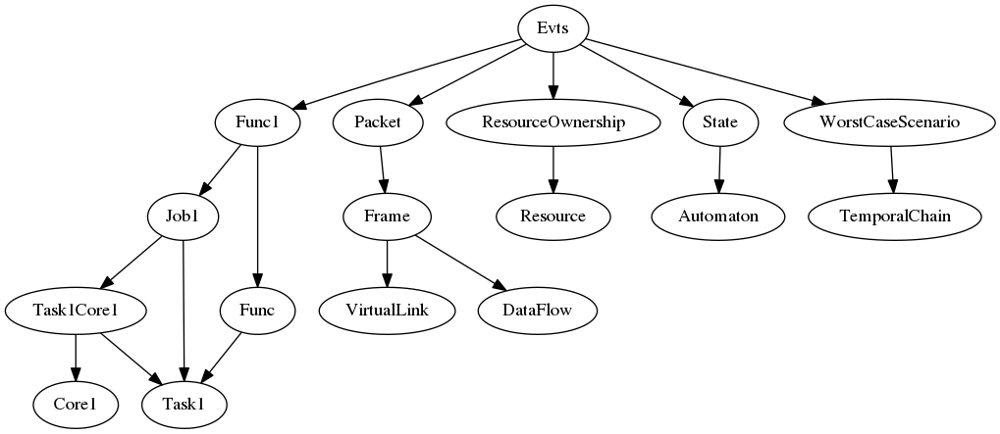
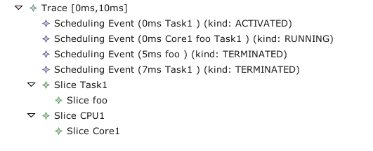
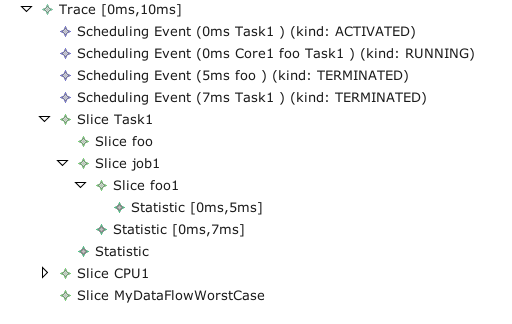
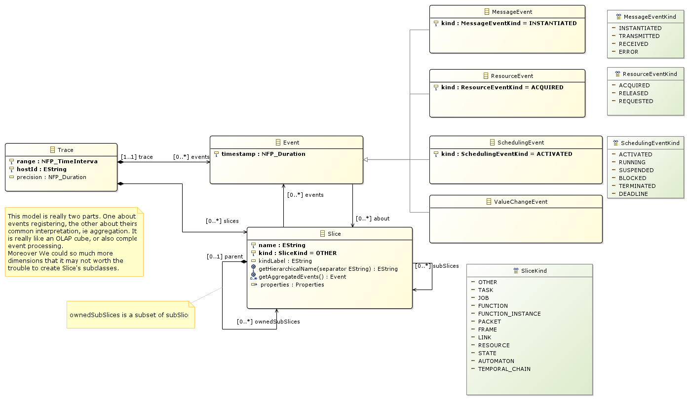

//Start of user code title
Trace
=====
//End of user code
:data-uti:
:doctype: book
//Start of user code header
	
//End of user code

//Start of user code preface
	
== Introduction

The goal of this meta-model is to keep traces of events about timing concerns.
Those events come from different possible sources:

* simulators
* analysis providing worst cases
* real network traces
* application logs

More over we must not reinvent the wheel, or at least gain experience from previous projects. That is:

* Tempo metamodel traces
* http://tracecompass.org/[Trace Compass]
* https://en.wikipedia.org/wiki/Complex_event_processing[Complex Event Processing (CEP)]
* https://en.wikipedia.org/wiki/Online_analytical_processing[OLAP]

Finally, it is mandatory for the meta-model to be self-contained.

== Rationale

=== &hellip;from running code

Let say that your code is creating the events itself. For that you may have a @log@ function that create a timestamp and a message.

[source,c]
--------------
void foo()
{
  log("Running foo"):
  /* ... */
  log("foo terminated"):
}

void task1Code()
{
  log("Running task1");
  /* ... */
  foo();
  /* ... */
  log("task1 terminated");
}

void main()
{
   task1 = xTaskCreate(task1Code, ...);
}
--------------

In that case, when generating the event you only have references to functions and tasks' definition.

NB: Most of the time you will have a 1:1 relation between task and definition of task but it may not always be the case.

=== &hellip;from simulator

In this case, the simulator knows everything from step (aka function) and step's instance, job and task, and even the computing resource used.
If it includes a network (sub)simulator or a functional (sub)simulator, you will also know the resource ownership and requests.

== Synthesis

The problem is that events can be aggregated in overlapping traces, ie they have several dimensions of interpretation. On the following diagram, the arrow shall be interpreted as "is a subset of":

This forms a lattice and not a strict hierarchy.

Thus our meta-model must separate the list of events, ie the log, and its analysis. Thus the @Trace@ concept is here to *contains* the list of events, while the @Slice@ will _aggregate_ some events in a hierarchical way.

Obviously, on events creation, one partially know about some of those slices (Task, Step/Function, Job, Frame, etc) but not the whole hierarchy. Thus an interpretation pass (aka events analysis) may be necessary to build the hierarchy to fill in the blanks. The field @about@ of event is here to link to known slices. In the running code example, one may translate from string containing the name of the function to the Slice representing that function (really the extension of the function).

But Task/Job/Function is not the whole story. Designers are also interested in end-to-end analysis. Thus this model allow tools to link a chain a events which has cross-cutting concerns.

== Examples

An implementation may give the following trace:

Then, one may analysed the traces to consolidate it, ie aggregate more dimensions, like the resource, the jobs, the function instance, etc.

Obviously, a simulator may already provides a consolidated traces.

Also note how one can refer to temporal chain of events, like the worst case scenario for a data-flow for instance.

//End of user code

[[trace_package]]
== Trace package

=== Overview

.trace-class-diagram-overview
[caption="trace class diagram overview -- http://www.polarsys.org/time4sys/trace/1.0"]

//Start of user code traceoverview
	
//End of user code

Return the Events of this slice ordered by timestamp.

[[trace_classifier]]
=== Trace classifier

//Start of user code Trace-overview
	
//End of user code

==== Attributes

* range: NFP_TimeInterval [1:1]
* hostId: EString [1:1]See TraceCompass hostId.
[quote,TraceCompass]
------------
The host ID is not necessarily the hostname, but should be a unique identifier for the machine on which the trace was taken.
It can be used to determine if two traces were taken on the exact same machine (timestamp already synchronized, resources with same id are the same if taken at the same time, etc).
------------
* precision: NFP_Duration [0:1]

==== Semantics

//Start of user code Trace-semantics
A generic container of list of events that has either been observed, simulated, or computed (like a worst-case scenario). 
//End of user code

[[event_classifier]]
=== Event classifier

//Start of user code Event-overview
	
//End of user code

==== Specializations

* <<resourceevent_classifier,ResourceEvent>> from <<trace_package,trace>>
* <<schedulingevent_classifier,SchedulingEvent>> from <<trace_package,trace>>
* <<messageevent_classifier,MessageEvent>> from <<trace_package,trace>>
* <<valuechangeevent_classifier,ValueChangeEvent>> from <<trace_package,trace>>
* <<objectvaluechangeevent_classifier,ObjectValueChangeEvent>> from <<trace_package,trace>>
* <<durationvaluechangeevent_classifier,DurationValueChangeEvent>> from <<trace_package,trace>>
* <<datasizevaluechangeevent_classifier,DataSizeValueChangeEvent>> from <<trace_package,trace>>
* <<numbervaluechangeevent_classifier,NumberValueChangeEvent>> from <<trace_package,trace>>

==== Attributes

* timestamp: NFP_Duration [1:1]

==== Semantics

//Start of user code Event-semantics
TODO: write a semantic
//End of user code

[[nfp_duration_classifier]]
=== NFP_Duration classifier

//Start of user code NFP_Duration-overview
A generic Duration as defined per NFP Package from Time4sys project.
//End of user code

See org.polarsys.time4sys.marte.nfp.Duration.

//Start of user code NFP_Duration-semantics
TODO: write a semantic
//End of user code

[[nfp_timeinterval_classifier]]
=== NFP_TimeInterval classifier

//Start of user code NFP_TimeInterval-overview
A generic Time interval as defined per NFP Package from Time4sys project.
//End of user code

See org.polarsys.time4sys.marte.nfp.TimeInterval.

//Start of user code NFP_TimeInterval-semantics
TODO: write a semantic
//End of user code

[[schedulingeventkind_classifier]]
=== SchedulingEventKind classifier

//Start of user code SchedulingEventKind-overview
This shall be enough to described the state-machine of classical tasks.
//End of user code

==== Values

* ACTIVATED 
* RUNNING 
* SUSPENDED 
* BLOCKED 
* TERMINATED 
* DEADLINE 

==== Semantics

//Start of user code SchedulingEventKind-semantics

It expected to follow this state-machine:
// TODO

//End of user code

[[resourceevent_classifier]]
=== ResourceEvent classifier

//Start of user code ResourceEvent-overview
//End of user code

==== Generalizations

* <<event_classifier,Event>> from <<trace_package,trace>>

==== Attributes

* kind: ResourceEventKind [1:1]

==== Semantics

//Start of user code ResourceEvent-semantics
TODO: write a semantic
//End of user code

[[schedulingevent_classifier]]
=== SchedulingEvent classifier

//Start of user code SchedulingEvent-overview
	
//End of user code

==== Generalizations

* <<event_classifier,Event>> from <<trace_package,trace>>

==== Attributes

* kind: SchedulingEventKind [1:1]

==== Semantics

//Start of user code SchedulingEvent-semantics
TODO: write a semantic
//End of user code

[[resourceeventkind_classifier]]
=== ResourceEventKind classifier

//Start of user code ResourceEventKind-overview
	
//End of user code

==== Values

* ACQUIRED 
* RELEASED 
* REQUESTED 

==== Semantics

//Start of user code ResourceEventKind-semantics
TODO: write a semantic
//End of user code

[[messageevent_classifier]]
=== MessageEvent classifier

//Start of user code MessageEvent-overview
	
//End of user code

==== Generalizations

* <<event_classifier,Event>> from <<trace_package,trace>>

==== Attributes

* kind: MessageEventKind [1:1]

==== Semantics

//Start of user code MessageEvent-semantics
TODO: write a semantic
//End of user code

[[messageeventkind_classifier]]
=== MessageEventKind classifier

//Start of user code MessageEventKind-overview
	
//End of user code

==== Values

* INSTANTIATED 
* TRANSMITTED 
* RECEIVED 
* ERROR 

==== Semantics

//Start of user code MessageEventKind-semantics
TODO: write a semantic
//End of user code

[[slice_classifier]]
=== Slice classifier

A slice is an aggregation of Events so as to group them together in a logical way.
For instance, it could be:

* the Gantt line view of a processor usage,
* an end-to-end dataflow,
* an end-to-end network packet travel,
* etc.

//Start of user code Slice-overview
	
//End of user code

==== Attributes

* name: EString [1:1]
* kind: SliceKind [1:1]
* kindLabel: EString [0:1]

==== Semantics

//Start of user code Slice-semantics
TODO: write a semantic
//End of user code

[[slicekind_classifier]]
=== SliceKind classifier

//Start of user code SliceKind-overview
	
//End of user code

==== Values

* OTHER 
* TASK 
* JOB 
* FUNCTION 
* FUNCTION_INSTANCE 
* PACKET 
* FRAME 
* LINK 
* RESOURCE 
* STATE 
* AUTOMATON 
* TEMPORAL_CHAIN 
* OS 

==== Semantics

//Start of user code SliceKind-semantics
TODO: write a semantic
//End of user code

[[properties_classifier]]
=== Properties classifier

//Start of user code Properties-overview
	
//End of user code

==== Attributes

* range: NFP_TimeInterval [0:1]
* blockingTime: NFP_Duration [0:1]
* executionTime: NFP_Duration [0:1]
* remainingTime: NFP_Duration [0:1]
* responseTime: NFP_Duration [0:1]
* absoluteDeadline: NFP_Duration [0:1]
* index: ELong [0:1]

==== Semantics

//Start of user code Properties-semantics
TODO: write a semantic
//End of user code

[[valuechangeevent_classifier]]
=== ValueChangeEvent classifier

//Start of user code ValueChangeEvent-overview
	
//End of user code

==== Generalizations

* <<event_classifier,Event>> from <<trace_package,trace>>

==== Specializations

* <<objectvaluechangeevent_classifier,ObjectValueChangeEvent>> from <<trace_package,trace>>
* <<durationvaluechangeevent_classifier,DurationValueChangeEvent>> from <<trace_package,trace>>
* <<datasizevaluechangeevent_classifier,DataSizeValueChangeEvent>> from <<trace_package,trace>>
* <<numbervaluechangeevent_classifier,NumberValueChangeEvent>> from <<trace_package,trace>>

==== Semantics

//Start of user code ValueChangeEvent-semantics
TODO: write a semantic
//End of user code

[[objectvaluechangeevent_classifier]]
=== ObjectValueChangeEvent classifier

//Start of user code ObjectValueChangeEvent-overview
TODO: write an overview
//End of user code

==== Generalizations

* <<valuechangeevent_classifier,ValueChangeEvent>> from <<trace_package,trace>>

==== Semantics

//Start of user code ObjectValueChangeEvent-semantics
TODO: write a semantic
//End of user code

[[durationvaluechangeevent_classifier]]
=== DurationValueChangeEvent classifier

//Start of user code DurationValueChangeEvent-overview
TODO: write an overview
//End of user code

==== Generalizations

* <<valuechangeevent_classifier,ValueChangeEvent>> from <<trace_package,trace>>

==== Attributes

* value: NFP_Duration [1:1]

==== Semantics

//Start of user code DurationValueChangeEvent-semantics
TODO: write a semantic
//End of user code

[[datasizevaluechangeevent_classifier]]
=== DataSizeValueChangeEvent classifier

//Start of user code DataSizeValueChangeEvent-overview
TODO: write an overview
//End of user code

==== Generalizations

* <<valuechangeevent_classifier,ValueChangeEvent>> from <<trace_package,trace>>

==== Attributes

* value: NFP_DataSize [1:1]

==== Semantics

//Start of user code DataSizeValueChangeEvent-semantics
TODO: write a semantic
//End of user code

[[numbervaluechangeevent_classifier]]
=== NumberValueChangeEvent classifier

//Start of user code NumberValueChangeEvent-overview
TODO: write an overview
//End of user code

==== Generalizations

* <<valuechangeevent_classifier,ValueChangeEvent>> from <<trace_package,trace>>

==== Attributes

* value: ENumber [1:1]

==== Semantics

//Start of user code NumberValueChangeEvent-semantics
TODO: write a semantic
//End of user code

[[enumber_classifier]]
=== ENumber classifier

//Start of user code ENumber-overview
TODO: write an overview
//End of user code

See java.lang.Number.

//Start of user code ENumber-semantics
TODO: write a semantic
//End of user code

[[nfp_datasize_classifier]]
=== NFP_DataSize classifier

//Start of user code NFP_DataSize-overview
TODO: write an overview
//End of user code

See org.polarsys.time4sys.marte.nfp.DataSize.

//Start of user code NFP_DataSize-semantics
TODO: write a semantic
//End of user code

//Start of user code postface
	
//End of user code

